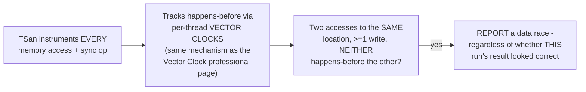
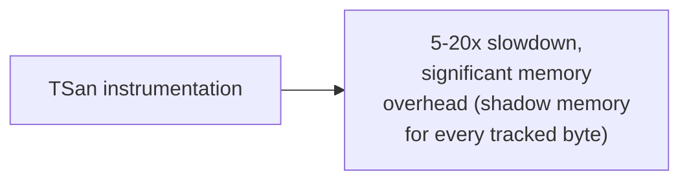

# Race Conditions — Professional

<!-- level-focus -->
At professional level, focus on this question:

> How does ThreadSanitizer (and similar race detectors) actually detect a
> race during a single test run, without needing to get lucky on timing?

Prerequisite: [`senior.md`](senior.md).

---

## Happens-before violation detection, not timing luck

ThreadSanitizer (TSan) doesn't rely on the specific interleaving that
happened to occur during a test run producing a visibly wrong result
(`senior.md`'s "got lucky" problem) — instead, it instruments **every**
memory access and synchronization operation, and tracks a **vector-clock**
-based happens-before relationship (per the Vector Clock professional
page's exact mechanism, applied here to instruction-level memory
accesses instead of distributed-system events) between all threads'
operations. If it observes two accesses to the same memory location, at
least one a write, where **neither** access happens-before the other
according to the tracked vector clocks — a genuine data race, by
definition — it reports it, **even if** the specific run's actual
scheduling happened to produce a "correct-looking" result this time.

This is precisely why TSan can catch races that a manual test run would
miss entirely: it detects the **structural absence of a happens-before
relationship**, which is present regardless of which specific
interleaving actually occurred during that run — a race that "got lucky"
and produced a correct-looking value is still flagged, because the
underlying synchronization gap is real and detectable independent of the
specific outcome.

## The real cost: instrumentation overhead

This comprehensive tracking comes at a real cost — TSan-instrumented code
runs 5-20x slower with substantial additional memory overhead (per the
Locking & Concurrency Control professional page's sanitizer discussion),
which is why it's used in dedicated CI test runs, not in production
deployments.

> 🎯 **Professional-level insight:** the reason "run it under TSan in
> CI" is repeatedly recommended throughout this tree (see the
> Shared-Memory Concurrency and Locking & Concurrency Control
> professional pages) is precisely this happens-before-violation
> detection mechanism — it converts "hope we get unlucky enough during
> testing to catch the race" into "detect the structural absence of
> synchronization, deterministically, on any run that exercises the
> racy code path at all," a fundamentally stronger guarantee than
> `senior.md`'s "run it a thousand times" approach.

## Test yourself

1. Why can ThreadSanitizer detect a race even in a run where the actual
   memory values ended up "looking correct" by chance?
2. Why does TSan's happens-before tracking use the same conceptual
   mechanism (vector clocks) as distributed systems' causality tracking?
3. Why is TSan used in CI rather than production, given its detection
   power?

## Further Reading

- Serebryany & Iskhodzhanov — "ThreadSanitizer: Data Race Detection in
  Practice" (the original TSan paper, detailing the happens-before
  violation algorithm).
- See also: [Vector Clock — professional](../../../distributed-system/vector-clock/professional.md),
  [Locking & Concurrency Control — professional](../../../databases/transaction/09-locking-and-concurrency-control/professional.md).
