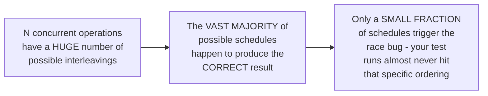
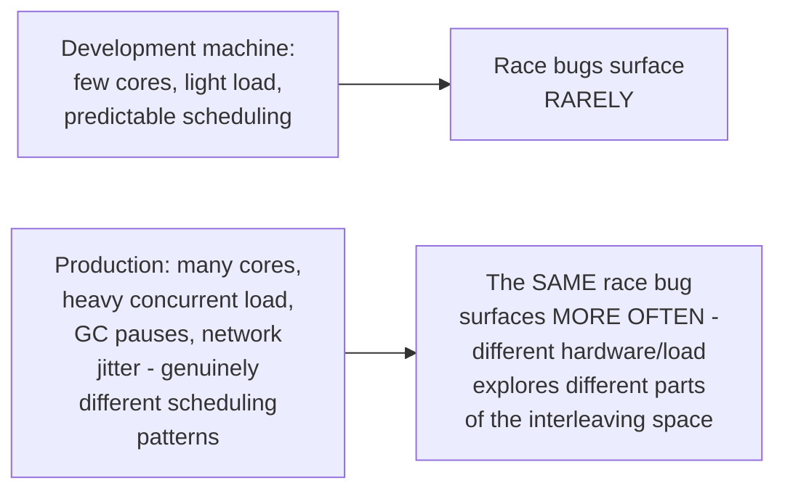

# Race Conditions — Senior

<!-- level-focus -->
At senior level, focus on this question:

> Why can a race-condition bug pass every test run in development and
> still fail in production, sometimes only once a week?

Prerequisite: [`middle.md`](middle.md).

---

## The interleaving space is enormous, and most schedules are "lucky"

A race condition's bug only manifests under **specific** interleavings of
concurrent operations — out of the astronomically large number of
possible orderings, the buggy ones might be a tiny fraction. Running a
test suite (even a "concurrent" test) a handful of times samples this
enormous space essentially at random, and is highly likely to miss the
rare bad orderings entirely — this is precisely why "it passed all our
tests" provides very weak evidence of race-freedom.

## Production conditions change the odds

Production environments (more cores enabling genuine parallelism instead
of time-sliced concurrency, higher load creating more contention, GC
pauses and network jitter introducing different timing patterns) explore
a genuinely different, often much larger, portion of the interleaving
space than a quiet development machine — this is exactly the "more cores
means more true parallelism which exposes races faster" phenomenon from
the Shared-Memory Concurrency junior page's tricky-questions section,
now generalized to the full production-vs-development environment
mismatch.

> 🎯 **Senior takeaway:** the absence of observed race bugs is not
> evidence of their absence — it's evidence that your specific test runs,
> under your specific test conditions, haven't hit the bad interleaving
> yet. This is precisely why race detection tooling (`professional.md`)
> that can prove absence of races (or systematically explore many more
> interleavings than manual testing) is qualitatively more valuable than
> "we ran it a thousand times and it was fine."

## Test yourself

1. Why does running a concurrent test many times provide weak evidence of
   race-freedom, even if it never fails?
2. Why might a race bug that never manifests in a 4-core development
   environment start appearing regularly in a 64-core production server?
3. What kind of tooling or technique would give you stronger confidence
   than repeated manual test runs?

Continue to [`professional.md`](professional.md) to see how ThreadSanitizer
actually detects races algorithmically.
