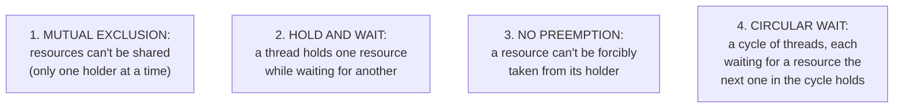
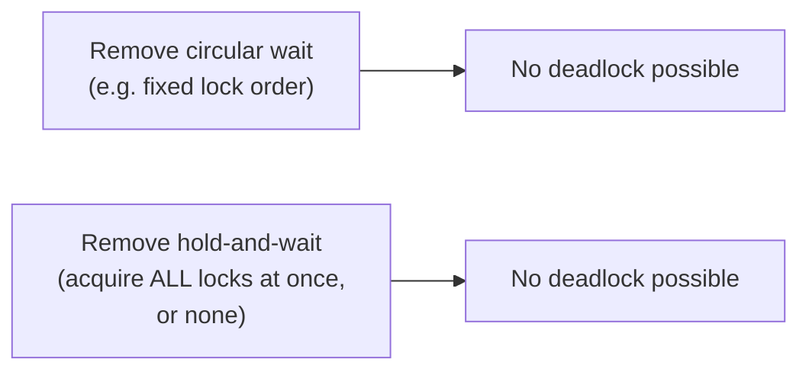

# Deadlock Detection — Junior

<!-- level-focus -->
At junior level, focus on this question:

> What are the four necessary conditions for deadlock, and why does
> removing any single one prevent it entirely?

---

## The four Coffman conditions



All **four** conditions must hold simultaneously for deadlock to occur —
this is a foundational, formally proven result (the Coffman conditions,
1971). A concrete example satisfying all four:

```python
# Thread 1                     # Thread 2
lock_A.acquire()                lock_B.acquire()
# ... holds A, wants B ...      # ... holds B, wants A ...
lock_B.acquire()  # BLOCKS       lock_A.acquire()  # BLOCKS
```

## Why removing any ONE condition prevents deadlock



If you eliminate **any single** condition, deadlock becomes structurally
impossible — this is why prevention strategies target just one condition
rather than needing to address all four: fixed lock ordering (`middle.md`)
eliminates circular wait; acquiring all needed locks atomically upfront
eliminates hold-and-wait; a timeout-based "give up and retry" approach
(`senior.md`) effectively breaks hold-and-wait by releasing what you hold
if you can't get everything.

> 🎓 **Takeaway:** you don't need a clever fix targeting all four
> conditions — breaking just one, chosen based on what's practical for
> your specific system, is sufficient to prevent deadlock entirely.

## Test yourself

1. Why must ALL FOUR conditions hold simultaneously for deadlock to
   occur — construct a scenario missing just one condition and explain
   why it can't deadlock.
2. Why does a fixed lock-acquisition order specifically eliminate the
   "circular wait" condition?
3. Name a real system design elsewhere in this tree that eliminates
   hold-and-wait by acquiring everything needed atomically upfront
   (hint: think about the TCC pattern's Try phase).

Continue to [`middle.md`](middle.md).
