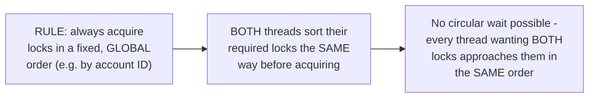

# Deadlock Detection — Middle

<!-- level-focus -->
At middle level, focus on this question:

> How does applying a fixed lock-acquisition order actually eliminate
> deadlock, in a concrete two-lock scenario?

Prerequisite: [`junior.md`](junior.md).

---

## The problem, restated

```python
# Thread 1                     # Thread 2 (opposite order - DANGEROUS)
lock_A.acquire()                lock_B.acquire()
lock_B.acquire()                lock_A.acquire()
```

Both threads acquire the same two locks, but in **opposite** order — this
is exactly what creates the possibility of circular wait
(`junior.md`'s condition 4).

## The fix: always acquire in the same, fixed order

```python
# Both threads acquire in the SAME order, always: A before B
def transfer(from_account, to_account, amount):
    first, second = sorted([from_account, to_account], key=lambda a: a.id)
    with first.lock:
        with second.lock:
            # perform the actual transfer logic
            ...
```



By deriving the acquisition order from a stable property of the
resources themselves (e.g. sorting by account ID) rather than the order
the *business logic* happens to want them, **every** thread — regardless
of which account is the "from" and which is the "to" in its specific
call — ends up acquiring locks in the same global order, eliminating the
possibility of two threads waiting on each other in a cycle.

> 🎓 **Takeaway:** fixed lock ordering works by deriving a canonical,
> resource-intrinsic order (not a call-site-specific order) and applying
> it consistently everywhere in the codebase that might need to hold
> multiple locks simultaneously — this requires discipline across the
> **entire** codebase, not just one function, which is why it's easy to
> violate accidentally in a large system without a clear convention.

## Test yourself

1. Why does sorting by account ID (a stable, resource-intrinsic property)
   work, while sorting by "which account is 'from' in this specific
   call" would not?
2. What would happen if a third function elsewhere in the codebase
   acquired these same two locks in the opposite order, unaware of the
   convention?
3. Why does fixed lock ordering require discipline across an entire
   codebase, rather than being fixable in just one function?

Continue to [`senior.md`](senior.md).
