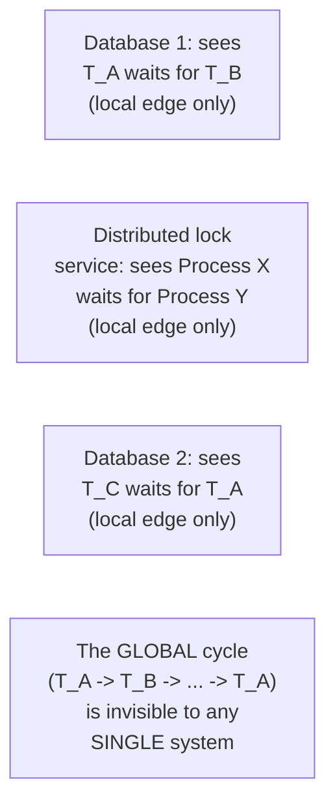
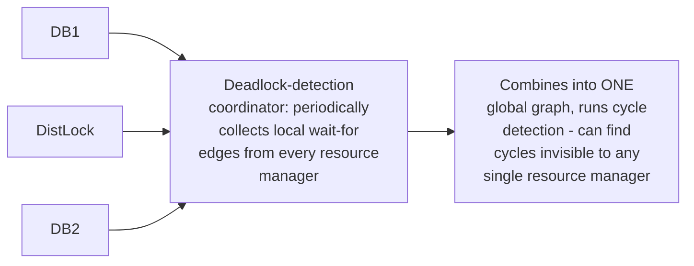

# Deadlock Detection — Professional

<!-- level-focus -->
At professional level, focus on this question:

> Why is detecting deadlock across multiple independent resource
> managers (two different databases, or a database and a distributed
> lock service) fundamentally harder than within one process?

Prerequisite: [`senior.md`](senior.md).

---

## No single, complete wait-for graph exists

`senior.md`'s wait-for-graph detection assumes **one** system has
complete visibility into every thread's waiting relationships. In a
distributed scenario — Transaction A on Database 1 waiting for a lock
held by Transaction B, which is itself waiting on a distributed lock held
by a process that's waiting on Database 1 again — **no single node** has
the full picture; each resource manager only sees its own local
wait-for edges.

## Distributed deadlock detection: combining partial graphs

Production distributed systems needing this capability typically
implement a **coordinator** that periodically collects each resource
manager's local wait-for edges and combines them into a global graph for
cycle detection — this is architecturally similar to the coordination-
service patterns covered in the Coordination Services professional page,
but specifically for aggregating deadlock-detection state rather than
locks/leases themselves. Some systems instead use **timeout-based**
approaches uniformly (accepting `senior.md`'s false-positive risk) simply
because building and operating a correct distributed wait-for-graph
aggregator is substantial additional engineering complexity that many
systems judge isn't worth it relative to accepting occasional
timeout-triggered aborts and retries.

## Why most systems avoid this and use TCC/sagas instead

> 🎯 **Professional-level insight:** the practical industry answer to
> "avoid distributed deadlock detection's complexity entirely" is
> precisely why the Atomic Commit professional page's TCC pattern and the
> Saga pattern (see Compensating Transaction) both deliberately avoid
> holding locks across multiple, independent resource managers for
> extended periods at all — a Try/reservation phase with a short,
> bounded hold time (rather than a long-lived cross-system lock) sidesteps
> the entire distributed-deadlock problem by construction, rather than
> solving it with a distributed detection mechanism. This is the same
> "restructure the problem rather than solve it head-on" theme from the
> Exactly-Once Semantics professional page's outbox-pattern discussion.

## Test yourself

1. Why can't any single resource manager detect a deadlock cycle that
   spans multiple independent systems?
2. What would a distributed deadlock-detection coordinator need to do
   periodically, and why is this itself real, added engineering
   complexity?
3. Explain why TCC's short-lived reservation phase sidesteps the
   distributed deadlock problem entirely, rather than solving it.

## Further Reading

- Chandy, Misra, Haas — "Distributed Deadlock Detection" (ACM TOCS, 1983 —
  a foundational algorithm for this exact problem).
- See also: [Atomic Commit: 2PC/3PC/TCC — professional](../../../distributed-system/18-concurrency-coordination/07-atomic-commit-2pc-3pc-tcc/professional.md),
  [Compensating Transaction — professional](../../../distributed-system/20-reliability-patterns/07-compensating-transaction/professional.md).
