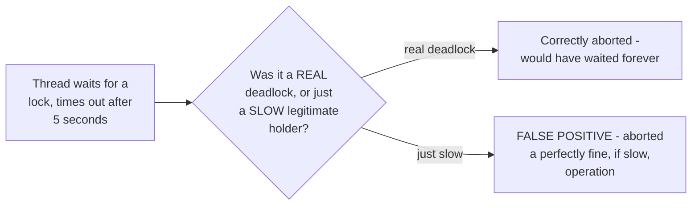
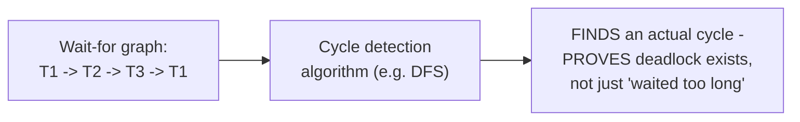

# Deadlock Detection — Senior

<!-- level-focus -->
At senior level, focus on this question:

> Why can a lock-acquisition timeout misidentify a slow-but-fine operation
> as a deadlock, and how do you tell the two apart?

Prerequisite: [`middle.md`](middle.md).

---

## Timeout-based "detection": a heuristic, not a proof

A lock-acquisition timeout (per the Locking & Concurrency Control
middle page's timeout-based deadlock approach) can't actually distinguish
"this will never resolve because of a cycle" from "the current holder is
just doing something slow but will release eventually" — it aborts both
cases identically after the timeout fires, meaning a legitimately slow
operation (a holder doing a large batch update, or contending with heavy
load) gets misdiagnosed and aborted exactly as if it were a genuine
deadlock.

## Wait-for-graph detection: a real proof, not a heuristic

Per the Locking & Concurrency Control professional page's wait-for-graph
discussion, a proper deadlock detector maintains an explicit graph of
"who's waiting for whom" and runs cycle detection — this **proves** a
deadlock exists (a genuine cycle, satisfying `junior.md`'s circular-wait
condition) rather than merely inferring one from "waited longer than an
arbitrary threshold." This distinguishes a real deadlock from a slow
holder precisely, at the cost of the graph-maintenance overhead that
detection cost scales with concurrently-waiting-transaction count (per
that professional page's discussion of this exact cost under high lock
contention).

> 🎯 **Senior takeaway:** timeout-based deadlock handling is simple and
> cheap but produces false positives under load (aborting slow-but-fine
> operations); wait-for-graph-based detection is precise (only aborts
> genuine cycles) but costs real bookkeeping overhead. Choose based on
> whether false-positive aborts (and their retry cost) are acceptable for
> your workload, or whether the precision is worth the graph-maintenance
> cost.

## Test yourself

1. Why can't a timeout mechanism distinguish "genuinely deadlocked" from
   "just slow" — what information would it need that it doesn't have?
2. Why does wait-for-graph cycle detection provide a genuine proof of
   deadlock, rather than an inference?
3. For a high-throughput OLTP system under heavy load (where legitimately
   slow transactions are common), would you prefer timeout-based or
   graph-based deadlock handling? Why?

Continue to [`professional.md`](professional.md) to see why deadlock
detection across multiple independent resource managers is harder still.
