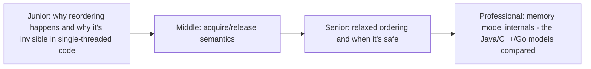
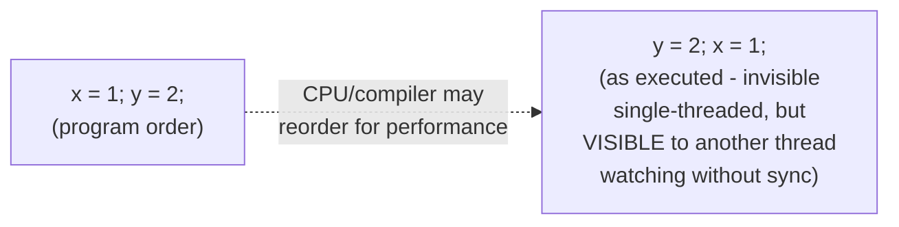

# Memory Models & Atomics Ordering

> CPUs and compilers reorder your code's memory operations for performance
> — as long as it doesn't change single-threaded behavior. A memory model
> is the formal contract specifying exactly what reordering is (and isn't)
> visible to other threads, and atomic ordering modes are how you control
> it precisely.

## Choose a level

| Level | Guide | You are done when |
|---|---|---|
| Junior | [Why reordering happens](junior.md) | You can explain why a CPU/compiler reordering memory operations is invisible in single-threaded code but not multi-threaded. |
| Middle | [Acquire/release semantics](middle.md) | You can explain what an acquire load and a release store each guarantee. |
| Senior | [Relaxed ordering](senior.md) | You can identify when relaxed ordering is safe to use versus when it isn't. |
| Professional | [Memory models compared](professional.md) | You can compare the Java, C++, and Go memory models' formal guarantees. |

## Practice rule

Before using a relaxed atomic operation (the weakest, fastest ordering),
ask: "does anything else in my program depend on the ORDER this
operation's effects become visible to other threads, or only on the
value itself eventually being visible?" If order matters, relaxed is the
wrong choice.

## Related

- [Shared-Memory Concurrency — middle](../01-models/01-shared-memory/middle.md)
- [Atomic (primitive)](../02-primitives/04-atomic/README.md)
