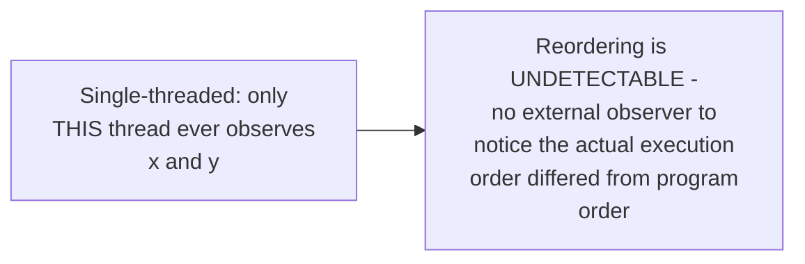
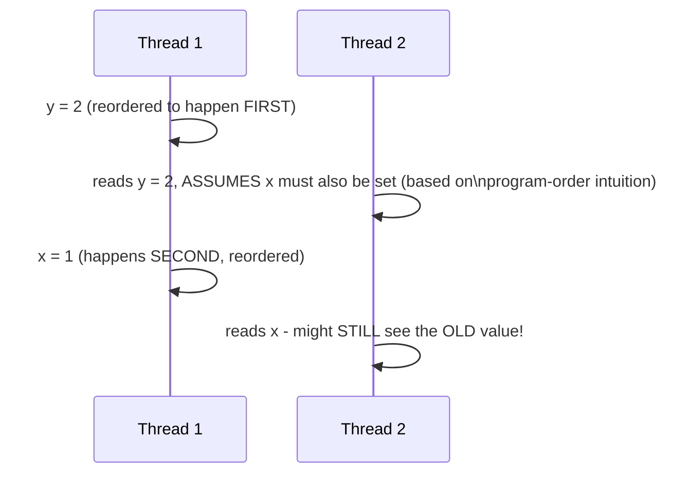

# Memory Models & Atomics Ordering — Junior

<!-- level-focus -->
At junior level, focus on this question:

> Why does reordering memory operations cause no visible problem in
> single-threaded code, but can cause real bugs in multi-threaded code?

---

## Reordering is invisible as long as you're the only observer

```c
x = 1;
y = 2;
// The CPU/compiler is free to actually execute these in either order -
// as long as, from THIS thread's own perspective, reading x and y
// afterward gives the same answer either way
```



Compilers and CPUs reorder instructions constantly for performance
(better pipelining, cache utilization) — this is completely safe and
invisible as long as the *only* thing that can observe memory is the
same thread that wrote it, because "as-if" semantics guarantee the
single-threaded **result** is unaffected, even if the actual execution
order was different.

## A second thread can observe the "wrong" order



If Thread 2 is watching **without proper synchronization**, it can
observe `y` updated before `x`, even though the source code wrote `x`
first — the reordering that was invisible in the single-threaded case
becomes a real, visible, and surprising bug the moment a second thread
is watching without a synchronization mechanism establishing
happens-before ordering between the two threads.

> 🎓 **Takeaway:** this is exactly the "the memory model determines when
> concurrent reads and writes are well-defined" statement from this
> folder's top-level README — reordering is a real, constant occurrence;
> what a memory model provides is a formal guarantee about which
> reorderings become **visible** to other threads under which
> synchronization conditions.

## Test yourself

1. Why is instruction reordering completely safe and invisible in
   single-threaded code?
2. Walk through the sequence diagram — what would Thread 2 need for a
   guarantee that it never observes `y` updated before `x`?
3. Why does this problem specifically require a SECOND thread observing
   the memory to become visible at all?

Continue to [`middle.md`](middle.md).
