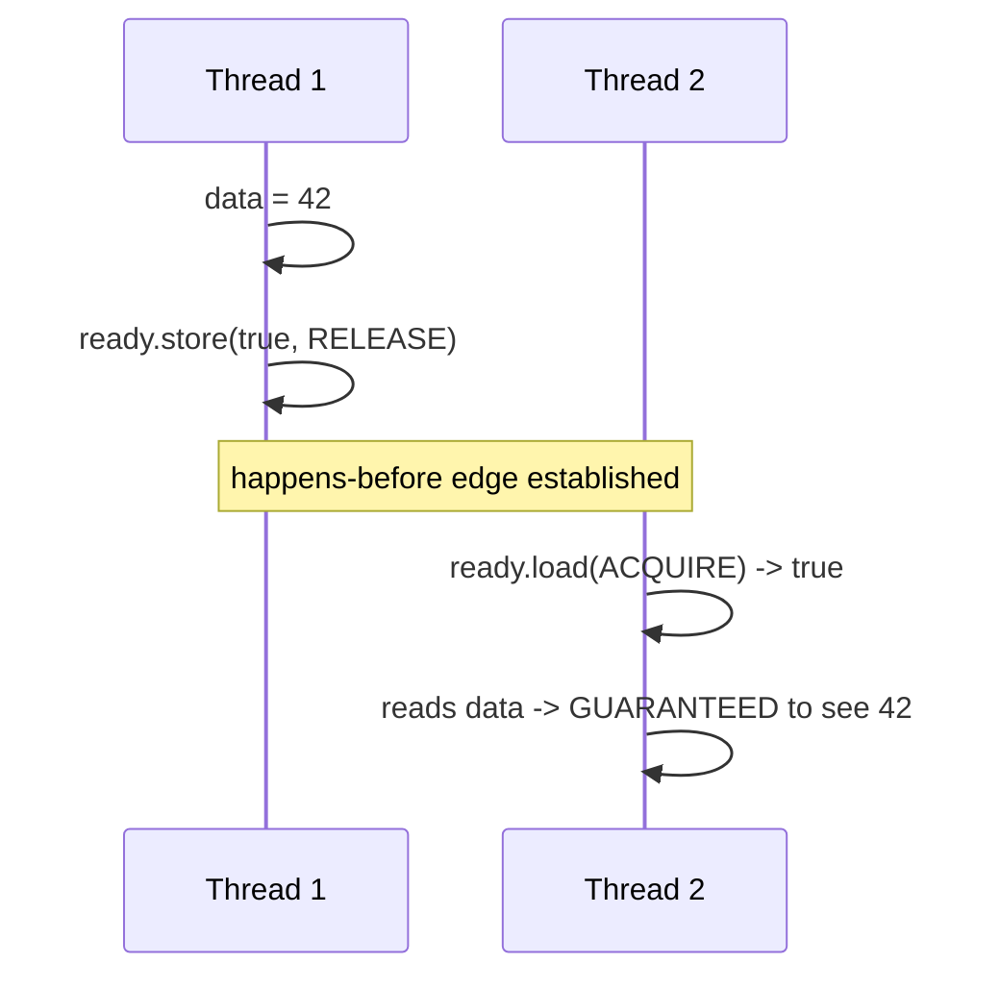

# Memory Models & Atomics Ordering — Middle

<!-- level-focus -->
At middle level, focus on this question:

> What exactly do an "acquire" load and a "release" store each guarantee?

Prerequisite: [`junior.md`](junior.md).

---

## Release: "everything I did before this point is now visible"

```cpp
data = 42;                                   // (1) ordinary write
ready.store(true, std::memory_order_release); // (2) RELEASE store
```

A **release** store guarantees that every memory operation **before** it
in program order (here, `data = 42`) is fully visible to any other thread
that subsequently performs a matching **acquire** load of the same
variable — the CPU/compiler is forbidden from reordering `data = 42` to
happen *after* the release store.

## Acquire: "everything the releaser did before their release is now visible to me"

```cpp
if (ready.load(std::memory_order_acquire)) {  // ACQUIRE load
    print(data);   // GUARANTEED to see 42, not the old/uninitialized value
}
```



An **acquire** load guarantees that everything the corresponding release
did **before** its release is visible after this acquire succeeds — this
release-acquire **pairing** is precisely the same happens-before
mechanism as a mutex's lock/unlock (per the Shared-Memory Concurrency
middle page's happens-before discussion), just exposed as an explicit,
lower-level atomic operation instead of hidden inside a mutex
implementation.

> 🎓 **Takeaway:** acquire/release semantics are the precise, minimal
> synchronization needed to publish a value safely from one thread to
> another — a mutex's lock/unlock is essentially "acquire on lock,
> release on unlock" under the hood; acquire/release atomics let you get
> this exact guarantee without the overhead of a full mutex when you only
> need to publish a single value or flag.

## Test yourself

1. Why must the release store happen AFTER `data = 42` in program order,
   and why would reordering them break the guarantee?
2. Why does an acquire load succeeding (seeing `true`) guarantee the
   reader sees `data = 42`, not some earlier or uninitialized value?
3. Why is acquire/release described as "the same mechanism as a mutex's
   lock/unlock," just exposed at a lower level?

Continue to [`senior.md`](senior.md).
