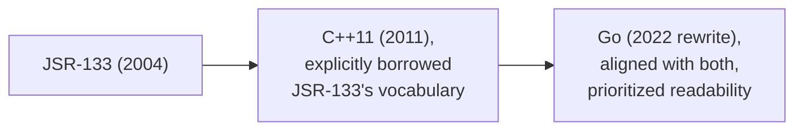
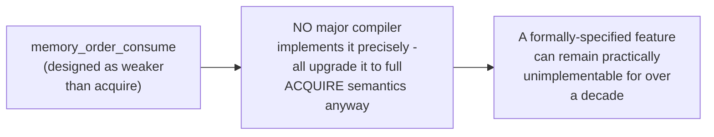

# Memory Models & Atomics Ordering — Professional

<!-- level-focus -->
At professional level, focus on this question:

> How do the Java, C++, and Go memory models differ in their formal
> guarantees, and why does this matter for writing genuinely portable
> concurrent code?

Prerequisite: [`senior.md`](senior.md).

---

## Three formalizations of the same underlying idea, with real differences

| Model | Origin | Notable characteristic |
|---|---|---|
| **JSR-133 (Java Memory Model)** | 2004, led by Doug Lea, Bill Pugh, Sarita Adve | First mainstream language with a precise, formal memory model; explicitly defines `volatile` semantics (equivalent to acquire/release) and `final` field guarantees. |
| **C++11 memory model** | 2011, Hans Boehm and SG1, explicitly modeled after JSR-133 | Adds the richest explicit ordering vocabulary (`relaxed`, `acquire`, `release`, `acq_rel`, `seq_cst`) — plus the notoriously difficult, rarely-correctly-implemented `memory_order_consume`. |
| **Go memory model** | Informal until 2014, formally rewritten in 2022 | Historically the least formally precise of the three; the 2022 rewrite explicitly added atomic-type semantics aligned with C++/Java, widely regarded as the most readable memory model document among mainstream languages. |

## Why `memory_order_consume` is a professional-level cautionary tale

C++'s `memory_order_consume` was designed as an even-weaker-than-acquire
ordering specifically for dependency-chains (reading through a pointer
you just acquired) — in principle, cheaper than full acquire semantics on
some architectures. In practice, **no major compiler has ever correctly
implemented its precise semantics** (they all conservatively upgrade it
to full acquire), and the C++ standards committee has been actively
discussing deprecating it for years — a real, professional-level lesson
that a memory-model feature can exist in a formal specification for
over a decade without ever having a genuinely correct, more-performant
implementation, because the precise dependency-tracking it requires
turned out to be far harder to implement correctly than anticipated.

## Writing portable concurrent code across these models

> 🎯 **Professional-level insight:** despite their differences, all three
> models agree on the **core, portable subset**: a mutex/lock establishes
> happens-before on release/acquire; a properly acquire/release-ordered
> atomic does too; relaxed atomics guarantee atomicity without ordering.
> Code relying **only** on this common subset (never on
> `memory_order_consume`, never on model-specific edge-case guarantees) is
> genuinely portable in its correctness reasoning across Java, C++, and
> Go — the professional-level discipline is knowing precisely where each
> model's specific guarantees end and sticking to the intersection when
> writing code (or reasoning about correctness) meant to be understood
> across language/runtime boundaries.

## Further Reading

- Manson, Pugh, Adve — "The Java Memory Model" (JSR-133, the original
  formal specification).
- Boehm & Adve — "Foundations of the C++ Concurrency Memory Model" (the
  paper underlying C++11's model).
- The Go Memory Model (go.dev/ref/mem, 2022 revision) — read alongside
  the original 2014 informal version for the contrast in rigor.
- See also: [Shared-Memory Concurrency — professional](../01-models/01-shared-memory/professional.md).
