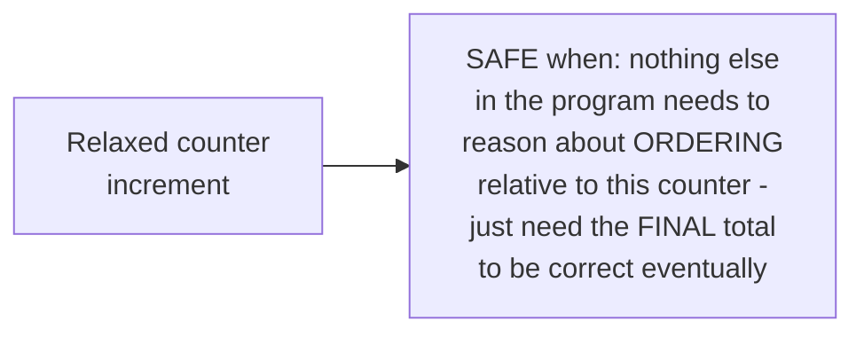
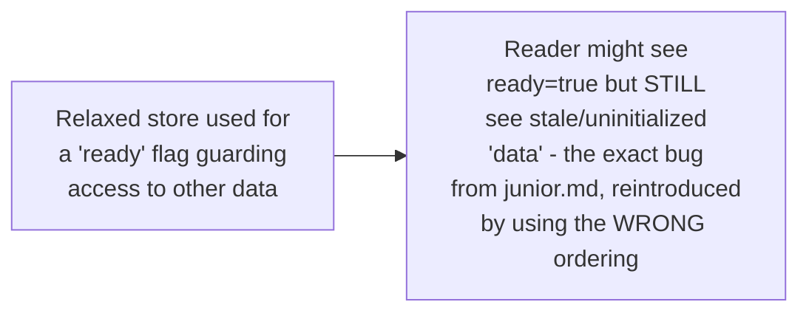

# Memory Models & Atomics Ordering — Senior

<!-- level-focus -->
At senior level, focus on this question:

> When is relaxed atomic ordering safe to use, and when does it risk
> subtle bugs?

Prerequisite: [`middle.md`](middle.md).

---

## Relaxed: atomicity guaranteed, ordering NOT guaranteed

```cpp
counter.fetch_add(1, std::memory_order_relaxed);
```

**Relaxed** ordering guarantees the operation itself is atomic (no torn
reads/writes, no lost updates on the counter itself) but makes **no**
promise about how this operation's effects order relative to any *other*
memory operation in the program — no happens-before edge is established
at all, unlike acquire/release (`middle.md`).

## When relaxed is safe: pure counters with no other dependent state



A simple statistics counter (total requests served) where you only care
about the eventual, correct total — not "did thread A's increment happen
before or after thread B's" — is a textbook safe use of relaxed ordering:
correctness (atomic increments, no lost updates) is preserved; ordering
simply doesn't matter for this use case.

## When relaxed is NOT safe: publishing data alongside a flag

```cpp
// WRONG: relaxed ordering gives NO guarantee that data is visible
// by the time ready is observed as true
data = 42;
ready.store(true, std::memory_order_relaxed);  // BUG: should be RELEASE
```



> 🎯 **Senior takeaway:** relaxed ordering is a genuine, meaningful
> optimization — but only for operations where **no other memory access
> depends on establishing a happens-before relationship** through it.
> The moment you're using an atomic variable to signal "it's now safe to
> read this other data," you need acquire/release (or stronger), not
> relaxed — using relaxed there silently reintroduces `junior.md`'s
> reordering bug, disguised as "using an atomic, so it should be safe."

## Test yourself

1. Why is relaxed ordering safe for a simple statistics counter but
   unsafe for a "ready" flag guarding access to other data?
2. What specifically does relaxed ordering guarantee, and what does it
   explicitly NOT guarantee?
3. Diagnose why a program using a relaxed atomic `ready` flag to guard
   reading a separate `data` variable can intermittently read stale data,
   even though the atomic operations themselves are "correct" (no torn
   reads/lost updates on `ready` itself).

Continue to [`professional.md`](professional.md) to compare the Java,
C++, and Go memory models' formal guarantees.
