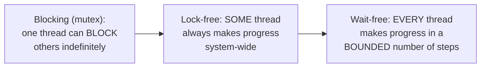

# Lock-Free & Wait-Free Algorithms

> Two distinct, formally-defined progress guarantees stronger than "uses a
> lock" — lock-free guarantees *someone* always makes progress; wait-free
> guarantees *everyone* makes progress in a bounded number of steps. Most
> "lock-free" code you'll encounter is actually only lock-free, not
> wait-free — this page makes the distinction precise.

## Choose a level

| Level | Guide | You are done when |
|---|---|---|
| Junior | [The progress-guarantee hierarchy](junior.md) | You can order blocking, obstruction-free, lock-free, and wait-free from weakest to strongest guarantee. |
| Middle | [Compare-and-swap](middle.md) | You can implement a lock-free counter using CAS and a retry loop. |
| Senior | [The ABA problem](senior.md) | You can construct an ABA scenario and explain how a tagged pointer fixes it. |
| Professional | [Why wait-free algorithms are rare](professional.md) | You can explain the practical cost that makes wait-free algorithms uncommon outside specialized systems. |

## Practice rule

Before calling your own code "lock-free," check for an unbounded retry
loop (`while not compare_and_swap(...): retry`) — if present, you have
lock-free (someone always progresses), not wait-free (bounded steps for
everyone) — a common, easy mislabeling.

## Related

- [Skip List — senior](../../../databases/performance/indexing/skip-list/senior.md)
- [Shared-Memory Concurrency — professional](../01-models/01-shared-memory/professional.md)
