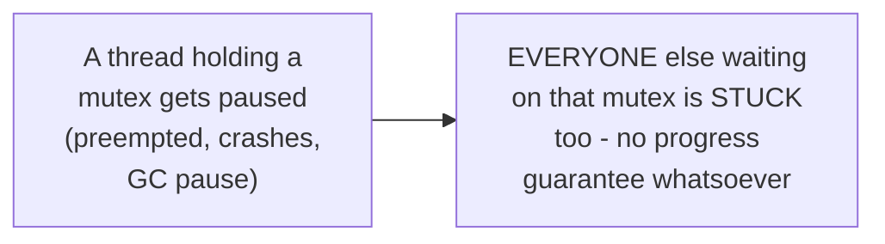
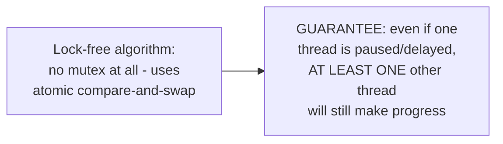
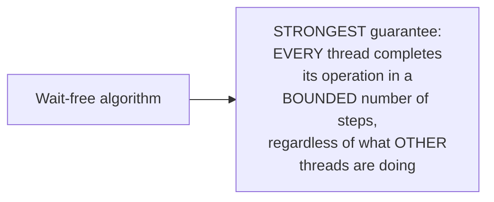

# Lock-Free & Wait-Free — Junior

<!-- level-focus -->
At junior level, focus on this question:

> How do blocking, lock-free, and wait-free differ in what they actually
> guarantee about progress?

---

## Blocking: no guarantee at all if one thread stalls

With a plain mutex, if the lock holder is paused for any reason, every
other thread waiting for that lock makes **zero** progress until the
holder resumes and releases it — this is exactly the lease-holder-pause
risk from the Leases & Fencing professional page, applied here to an
in-process mutex instead of a distributed lease.

## Lock-free: SOME thread always progresses, system-wide

A lock-free algorithm guarantees that, system-wide, **some** thread is
always making forward progress, even if any individual thread might be
delayed or retry repeatedly — no single paused thread can bring the
**entire** system to a halt the way a paused mutex-holder can.

## Wait-free: EVERY thread progresses, in a bounded number of steps

Wait-free is strictly stronger — it guarantees not just that *someone*
progresses, but that **every** thread's own operation completes within a
predictable, bounded number of steps, with zero risk of one thread being
repeatedly "outraced" by others (a real risk lock-free alone permits,
covered in `middle.md`).

> 🎓 **Takeaway:** this hierarchy (blocking < obstruction-free < lock-free
> < wait-free) is a real, formally defined progression of increasingly
> strong guarantees — most production "lock-free" data structures are
> genuinely lock-free but **not** wait-free, and confusing the two is a
> common imprecision worth avoiding.

## Test yourself

1. Why can a single paused thread stall an entire blocking (mutex-based)
   system, but not a lock-free one?
2. Why is wait-free a strictly stronger guarantee than lock-free — what
   can happen under lock-free that wait-free explicitly rules out?
3. Order these from weakest to strongest guarantee: wait-free, blocking,
   lock-free.

Continue to [`middle.md`](middle.md).
