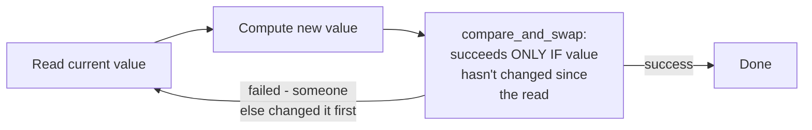
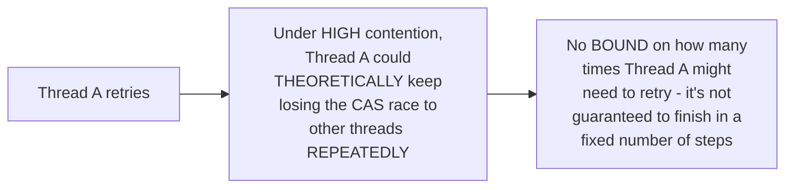

# Lock-Free & Wait-Free — Middle

<!-- level-focus -->
At middle level, focus on this question:

> How does compare-and-swap (CAS) let you implement a lock-free counter,
> and why is the retry loop what makes it "lock-free" rather than
> "wait-free"?

Prerequisite: [`junior.md`](junior.md).

---

## Compare-and-swap: an atomic "update only if unchanged" primitive

```python
def compare_and_swap(memory_location, expected, new_value):
    """Atomic, hardware-level: if memory_location currently equals
    expected, set it to new_value and return True. Otherwise, do
    nothing and return False. This ENTIRE check-and-set happens as
    ONE indivisible CPU operation."""
```

```python
def lock_free_increment(atomic_counter):
    while True:
        current = atomic_counter.load()
        new_value = current + 1
        if atomic_counter.compare_and_swap(current, new_value):
            return new_value  # succeeded
        # else: someone else changed it first - RETRY with the new current value
```



## Why the retry loop is "lock-free," not "wait-free"



Every CAS attempt that fails means **some other thread succeeded**
(satisfying `junior.md`'s lock-free guarantee: the system as a whole
always makes progress) — but there's no guarantee that any **specific**
thread's retry loop terminates in a bounded number of attempts; under
theoretically adversarial scheduling, one unlucky thread could keep
losing the race indefinitely (extremely unlikely in practice, but not
formally ruled out) — this is precisely why this pattern is lock-free,
not wait-free.

> 🎓 **Takeaway:** the "while True: try CAS, retry on failure" shape is
> the canonical lock-free pattern — every failure implies someone else's
> success (satisfying the lock-free definition), but the unbounded retry
> loop is exactly what prevents this from qualifying as wait-free.

## Test yourself

1. Why does a failed CAS attempt always mean some other thread's
   operation succeeded?
2. Why is a `while True: retry` loop, by its very shape, not compatible
   with a "bounded number of steps" guarantee?
3. Implement (in pseudocode) a lock-free stack push operation using CAS
   on the stack's head pointer.

Continue to [`senior.md`](senior.md).
