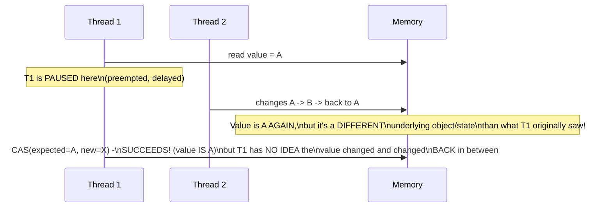
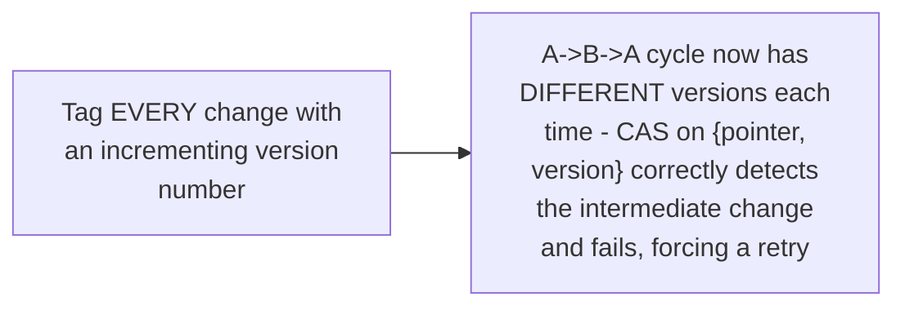

# Lock-Free & Wait-Free — Senior

<!-- level-focus -->
At senior level, focus on this question:

> What is the ABA problem, and how does a tagged pointer fix it?

Prerequisite: [`middle.md`](middle.md).

---

## The ABA scenario



CAS only compares the **current value** against the expected value — if
the value changed from A to B and back to A while a thread was paused,
the CAS **succeeds**, even though the underlying state has genuinely
changed in between (for a pointer: the object at address A might have
been freed and a **different** object happens to have been allocated at
the same address) — the thread's CAS-based logic incorrectly assumes
"nothing changed" just because the raw value matches.

## Tagged pointers: attach a version counter to detect this

```python
class TaggedPointer:
    def __init__(self, pointer, version):
        self.pointer = pointer
        self.version = version  # incremented on EVERY change, even A->B->A

def lock_free_pop(head):
    while True:
        current = head.load()  # {pointer: A, version: 5}
        next_node = current.pointer.next
        new_tagged = TaggedPointer(next_node, current.version + 1)
        if head.compare_and_swap(current, new_tagged):
            # succeeds only if BOTH pointer AND version still match -
            # an A->B->A cycle changes the version, so this CAS
            # correctly FAILS even though the raw pointer is back to A
            return current.pointer
```



> 🎯 **Senior takeaway:** the ABA problem is a subtle, easy-to-miss
> correctness gap in naive CAS-based lock-free code — any lock-free
> algorithm involving pointers that can be freed and reused (not just
> simple counters) needs ABA protection, typically via tagged/versioned
> pointers or a memory-reclamation scheme (hazard pointers, epoch-based
> reclamation, per the Shared-Memory Concurrency professional page's
> reclamation discussion) that prevents the "same address, different
> object" scenario from occurring at all.

## Test yourself

1. Walk through exactly why a plain CAS on a raw pointer can succeed
   incorrectly in the ABA scenario.
2. Why does attaching a monotonically incrementing version number to
   every change detect an A->B->A cycle that a raw value comparison
   would miss?
3. Why is ABA specifically a concern for pointer-based lock-free
   structures (stacks, queues) but not for a simple integer counter
   increment?

Continue to [`professional.md`](professional.md) to see why fully
wait-free algorithms remain rare in practice.
