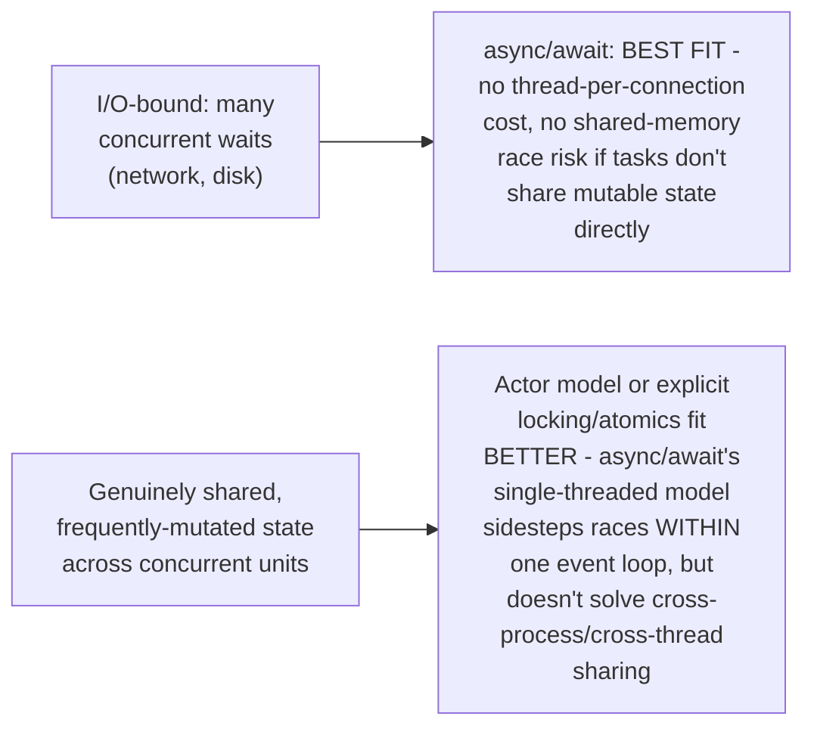

# Async/Await — Professional

<!-- level-focus -->
At professional level, focus on this question:

> How does async/await compare to the actor model, CSP, and shared-memory
> threading as concurrency models, and when would a staff engineer
> recommend one over the others?

Prerequisite: [`senior.md`](senior.md).

---

## The concurrency-model landscape, compared

| Model | Coordination mechanism | Where covered in depth |
|---|---|---|
| **Shared-memory + locks** | Threads share memory directly, mutexes/atomics coordinate access | [Shared-Memory Concurrency](../models/shared-memory/README.md) |
| **Message passing / CSP** | No shared state; explicit `send`/`recv` of values through channels | [Message Passing](../models/message-passing/README.md), [CSP](../models/csp/README.md) |
| **Actor model** | Isolated actors, each with a private mailbox, communicating via async messages | [Actor Model](../models/actor-model/README.md) |
| **Async/await** | Single-threaded (or small pool) event loop, cooperative suspension at await points | [Async Programming (full track)](../../async-programming/README.md) |

## Async/await's specific niche: I/O-bound concurrency without shared-memory hazards

Async/await's specific strength — sidestepping the C10K thread-per-
connection cost for I/O-bound work — comes with a specific limitation:
within a single event loop, there are no data races on shared mutable
state **between concurrent async tasks** (because only one runs at a
time, cooperatively, per `middle.md`), but this guarantee **evaporates**
the moment you run multiple event-loop threads/processes for true
parallelism, at which point you're back to needing the shared-memory
locking discipline (or an actor-style isolation) covered elsewhere in
this folder.

## A staff-level recommendation framework

> 🎯 **Professional-level insight:** recommend async/await specifically
> for I/O-bound concurrency within a service, especially when the
> language/runtime has strong async support (Python's asyncio, Rust's
> tokio, JavaScript's native event loop) and the workload doesn't need
> true multi-core parallelism for the async portion itself. Recommend the
> actor model or CSP-style channels when isolation between concurrent
> units matters more than raw I/O throughput (fault isolation,
> supervision trees — an actor crashing shouldn't corrupt shared state,
> because there is none). Recommend explicit shared-memory + locking only
> when you're building the lowest-level primitives everything else is
> implemented on top of, or need maximum raw performance and can pay the
> correctness-risk cost with careful engineering.

## Further Reading

- Go's own guidance ("share memory by communicating") and CSP's original
  formal model (Hoare, 1978) — see [CSP](../models/csp/professional.md)
  for the full professional-level treatment.
- See also: [Actor Model — professional](../models/actor-model/professional.md),
  [Async Programming (full track)](../../async-programming/README.md).
