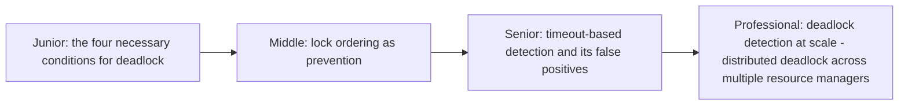

# Deadlock Detection

> Two or more threads, each holding a resource the other needs, waiting
> forever. This page covers the four necessary conditions for deadlock,
> the wait-for-graph detection algorithm (already introduced in Locking &
> Concurrency Control), and prevention strategies beyond "just use a fixed
> lock order."



```mermaid
flowchart LR
    T1["Thread 1: holds A,\nwants B"] -.wait-for.-> T2["Thread 2: holds B,\nwants A"]
    T2 -.wait-for.-> T1
    T1 -.-.- Cycle["CYCLE = deadlock"]
```

## Choose a level

| Level | Guide | You are done when |
|---|---|---|
| Junior | [The four necessary conditions](junior.md) | You can name all four conditions and explain why removing any one prevents deadlock. |
| Middle | [Lock ordering as prevention](middle.md) | You can apply a fixed lock-ordering rule to a two-lock scenario. |
| Senior | [Timeout-based detection and false positives](senior.md) | You can explain why a lock-acquisition timeout can misidentify a slow-but-fine operation as a deadlock. |
| Professional | [Distributed deadlock detection](professional.md) | You can explain why detecting deadlock across multiple independent resource managers is harder than within one process. |

## Practice rule

Before acquiring a second lock while already holding a first, ask: "does
every other code path in this codebase that acquires both of these locks
do so in the same order?" If you can't answer confidently, you have a
real, if latent, deadlock risk.

## Related

- [Locking & Concurrency Control — middle](../../../databases/transaction/locking-and-concurrency-control/middle.md)
- [Atomic Commit: 2PC/3PC/TCC](../../../distributed-system/coordination/atomic-commit-2pc-3pc-tcc/README.md)
