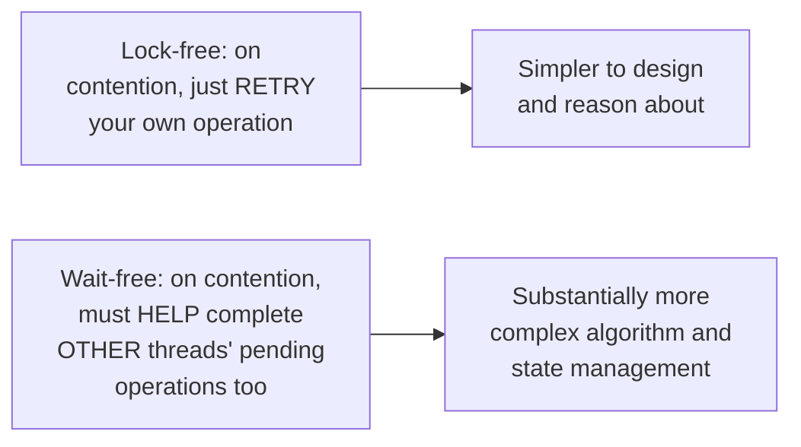
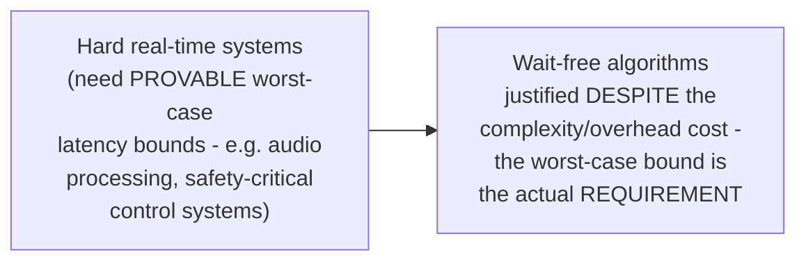

# Lock-Free & Wait-Free — Professional

<!-- level-focus -->
At professional level, focus on this question:

> Why do genuinely wait-free algorithms remain rare in production
> systems, despite being the strongest progress guarantee?

Prerequisite: [`senior.md`](senior.md).

---

## Wait-free algorithms are dramatically harder to design correctly

Herlihy's foundational work (referenced in the Shared-Memory Concurrency
professional page's wait-free hierarchy discussion) proved CAS is
**universal** — anything achievable lock-free can, in principle, be made
wait-free using CAS as the underlying primitive. But converting a
lock-free design (simple retry-on-failure, per `middle.md`) into a
genuinely wait-free one typically requires each thread to **help**
other threads complete their operations when contention is detected,
rather than simply retrying its own — a substantially more complex
algorithmic structure (the classic technique is called "operation
helping" or "announcement arrays," where a thread publishes its intended
operation so others can complete it on its behalf if it's stalled).

## The performance trade-off: helping isn't free either

Even where wait-free algorithms exist, the "helping" mechanism itself
adds overhead in the **uncontended** case (extra bookkeeping,
announcement-array checks) that a simpler lock-free retry loop doesn't
pay — meaning wait-free algorithms can be **slower** in the common,
low-contention case despite offering a stronger worst-case guarantee,
directly echoing the exact "theoretical guarantee vs. practical
performance" trade-off from the Skip List professional page's design
discussion (Redis choosing a probabilistic structure over a
theoretically-superior one for practical reasons).

## Where wait-free algorithms actually get used

> 🎯 **Professional-level insight:** wait-free algorithms remain rare
> outside specialized real-time domains precisely because most systems'
> actual requirement is "good average-case throughput" (well-served by
> the simpler lock-free retry pattern), not "a provable worst-case bound
> on every single operation" — reach for wait-free specifically when a
> hard real-time or safety-critical requirement genuinely demands the
> stronger guarantee, and accept the added design complexity and
> uncontended-case overhead as the necessary cost of that specific
> requirement.

## Test yourself

1. Why does converting a lock-free design to wait-free typically require
   "operation helping," and why does this add complexity?
2. Why can a wait-free algorithm be slower than a lock-free one in the
   common, low-contention case, despite its stronger worst-case
   guarantee?
3. Give an example of a system where the wait-free guarantee's cost would
   genuinely be justified, and one where it clearly wouldn't be.

## Further Reading

- Herlihy — "Wait-Free Synchronization" (ACM TOPLAS, 1991 — the original
  paper proving CAS's universality and formalizing the wait-free
  hierarchy).
- See also: [Shared-Memory Concurrency — professional](../models/shared-memory/professional.md),
  [Skip List — professional](../../../databases/performance/14-indexing%20%26%20filtering/skip-list/professional.md).
