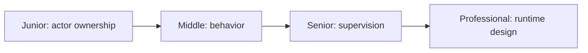
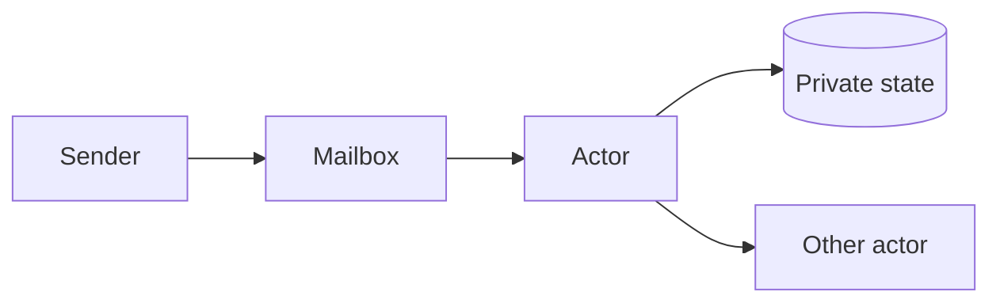

# Actor Model

> An actor owns state, processes one message at a time, and communicates only by messages.

| Level | Guide | You are done when |
|---|---|---|
| Junior | [Start](junior.md) | You can explain actor isolation. |
| Middle | [Apply](middle.md) | You can design messages and behavior. |
| Senior | [Operate](senior.md) | You can control failure and mailbox growth. |
| Professional | [Design](professional.md) | You can evaluate actor runtime trade-offs. |

**Practice rule:** Keep actor state private and mailbox capacity visible.

## Related

[Message passing](../message-passing/README.md) | [CSP](../csp/README.md)
