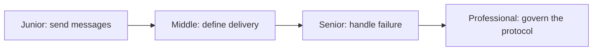
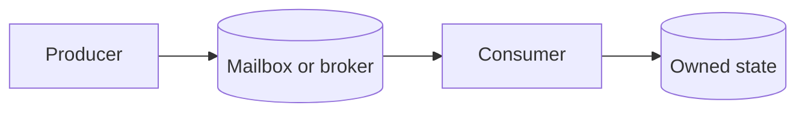

# Message Passing

> Components exchange explicit messages instead of changing the same state.

| Level | Guide | You are done when |
|---|---|---|
| Junior | [Start](junior.md) | You can explain ownership transfer. |
| Middle | [Apply](middle.md) | You can choose delivery and ordering rules. |
| Senior | [Operate](senior.md) | You can recover from duplicates and overload. |
| Professional | [Design](professional.md) | You can evolve and operate a message protocol. |

**Practice rule:** Make message identity, ownership, capacity, and failure behavior explicit.

## Related

[Actors](../actor-model/README.md) | [CSP](../csp/README.md) | [Channels](../../primitives/channels/README.md)
