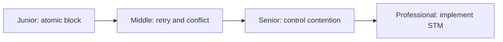
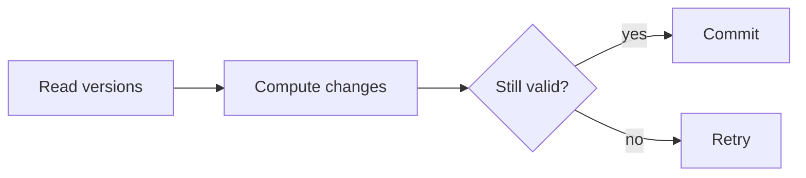

# Software Transactional Memory

> STM groups memory changes into transactions that commit together or retry after conflict.

| Level | Guide | You are done when |
|---|---|---|
| Junior | [Start](junior.md) | You can explain all-or-nothing memory updates. |
| Middle | [Apply](middle.md) | You can use retry without side effects. |
| Senior | [Operate](senior.md) | You can diagnose conflicts and starvation. |
| Professional | [Design](professional.md) | You can evaluate STM algorithms and guarantees. |

**Practice rule:** Keep transactions short, deterministic, and free of external I/O.

## Related

[Shared memory](../shared-memory/README.md) | [Atomics](../../primitives/atomic/README.md)
