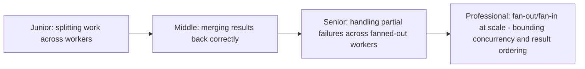
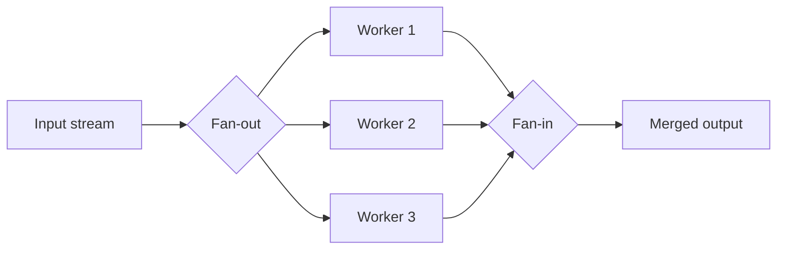

# Fan-Out / Fan-In

> Split one stream of work across multiple concurrent workers (fan-out),
> then merge their results back into one stream (fan-in). The
> in-process ancestor of the scatter-gather pattern and Spark's own
> parallel-stage execution model.

## Choose a level

| Level | Guide | You are done when |
|---|---|---|
| Junior | [Splitting work](junior.md) | You can explain why fanning out work to independent workers gives you parallelism. |
| Middle | [Merging results correctly](middle.md) | You can implement fan-in without losing or reordering results incorrectly. |
| Senior | [Partial failures](senior.md) | You can design a strategy for what happens when one of N fanned-out workers fails. |
| Professional | [Bounding concurrency at scale](professional.md) | You can design fan-out with a concurrency limit and deterministic result ordering. |

## Practice rule

Before fanning out work to N concurrent workers, ask: "if worker 3 out of
10 fails, what should happen to the other 9's results, and to the overall
operation?" This decision (fail-fast vs. partial-success) should be made
explicitly, not left as an accident of implementation.

## Related

- [Scatter-Gather Aggregator](../../../../distributed-system/distributed-transaction/scatter-gather-aggregator/README.md)
- [Spark](../../../../storage-system/spark/README.md)
