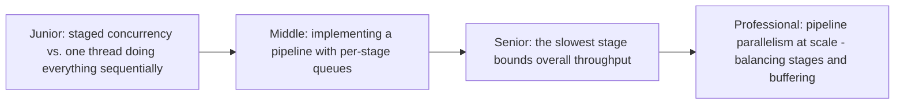
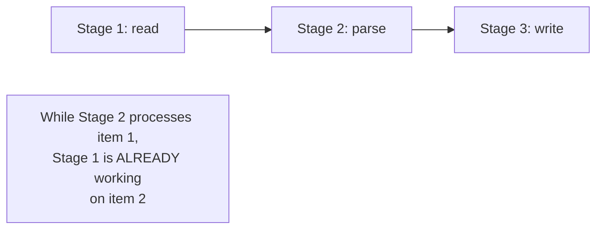

# Pipeline

> Break a task into sequential stages, each running concurrently on
> different items — while stage 2 processes item 1, stage 1 is already
> processing item 2. The in-process analog of a data pipeline's DAG,
> and the same shape as a CPU's own instruction pipeline.

## Choose a level

| Level | Guide | You are done when |
|---|---|---|
| Junior | [Staged concurrency](junior.md) | You can explain why a pipeline processes multiple items concurrently even with sequential stages. |
| Middle | [Implementing with per-stage queues](middle.md) | You can implement a 3-stage pipeline connected by queues. |
| Senior | [The slowest stage bounds throughput](senior.md) | You can identify and reason about a pipeline's bottleneck stage. |
| Professional | [Balancing stages at scale](professional.md) | You can design stage parallelism (multiple workers per stage) to balance an uneven pipeline. |

## Practice rule

For any multi-stage pipeline, measure each stage's throughput
independently before assuming the whole pipeline's performance is
uniform — one slow stage, however few others there are, determines the
entire pipeline's real throughput ceiling, per `senior.md`.

## Related

- [Fan-Out / Fan-In](../fan-in-fan-out/README.md)
- [Fan-Out Fan-In Pipeline](../../../../distributed-system/distributed-transaction/fan-out-fan-in-pipeline/README.md)
