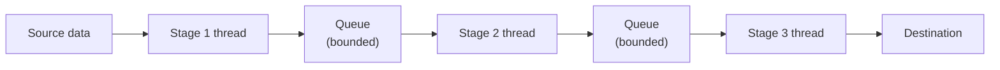

# Pipeline — Middle

<!-- level-focus -->
At middle level, focus on this question:

> How do you actually implement a pipeline by connecting stages with
> queues?

Prerequisite: [`junior.md`](junior.md).

---

## Each stage is its own worker(s), connected by queues

```python
import queue, threading

stage1_out = queue.Queue(maxsize=10)
stage2_out = queue.Queue(maxsize=10)

def stage1_read():
    for item in source_data:
        stage1_out.put(read_and_prepare(item))
    stage1_out.put(None)  # sentinel: signals "no more items"

def stage2_parse():
    while True:
        item = stage1_out.get()
        if item is None:
            stage2_out.put(None)
            break
        stage2_out.put(parse(item))

def stage3_write():
    while True:
        item = stage2_out.get()
        if item is None:
            break
        write_to_destination(item)

threads = [threading.Thread(target=fn) for fn in (stage1_read, stage2_parse, stage3_write)]
for t in threads: t.start()
```



Each queue between stages is exactly the bounded buffer from
[Producer-Consumer](../producer-consumer/README.md) — Stage 1 is a
producer to `stage1_out`, Stage 2 is both a consumer (of `stage1_out`)
and a producer (to `stage2_out`), and so on. The bounded queue size
between stages provides the exact same back-pressure benefit covered in
that pattern — if Stage 2 falls behind, Stage 1 will eventually block
(queue full) rather than producing unboundedly ahead of Stage 2's
capacity.

> 🎓 **Takeaway:** a pipeline is literally a chain of producer-consumer
> relationships — Stage N is simultaneously the consumer of the queue
> before it and the producer of the queue after it. Understanding this
> composition means you already understand pipelines, given
> Producer-Consumer.

## Test yourself

1. Why is each queue between stages exactly the bounded buffer pattern
   from Producer-Consumer?
2. What happens if `stage1_out`'s queue is full and Stage 1 tries to put
   another item — how does this provide back-pressure?
3. Why does Stage 2 act as both a consumer and a producer simultaneously
   in this design?

Continue to [`senior.md`](senior.md).
