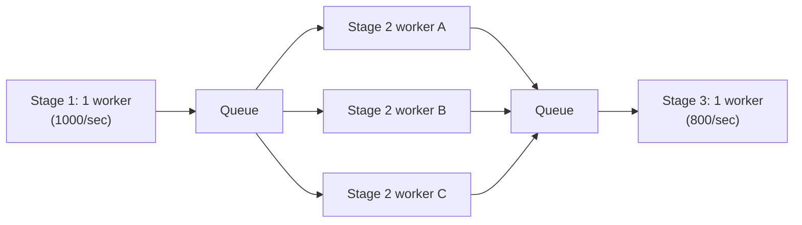
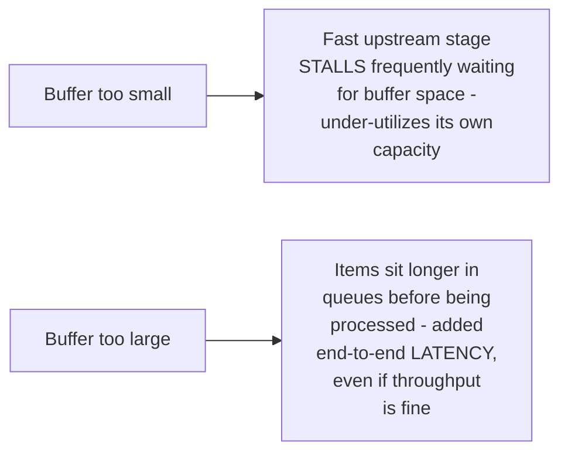

# Pipeline — Professional

<!-- level-focus -->
At professional level, focus on this question:

> How do you balance an uneven pipeline by running multiple workers for
> the bottleneck stage specifically, and how do you size buffer capacity
> between stages at scale?

Prerequisite: [`senior.md`](senior.md).

---

## Multiple workers for the bottleneck stage only



Rather than adding workers uniformly to every stage, `senior.md`'s
diagnosis directs you to add **multiple workers specifically to the
bottleneck stage** — running 3 instances of Stage 2's slow logic
(if the underlying work is parallelizable, per the fan-out pattern from
this same folder) can bring its **effective** throughput from 50/sec to
roughly 150/sec, potentially removing it as the bottleneck. This is
precisely the same targeted-scaling principle as Kafka consumer group
parallelism (per the Kafka professional page) or KEDA-style autoscaling
targeting the specific lagging component (per the Queue-Based Load
Leveling professional page) — scale the bottleneck specifically, not
every stage uniformly.

## Sizing inter-stage buffer capacity



Buffer size between stages is a real, tunable trade-off: too small causes
excessive blocking/stalling of upstream stages (reducing their effective
utilization even when they're fast); too large increases end-to-end
latency (an item can sit in a deep queue for a while even if every stage
is individually fast) without necessarily improving throughput further —
this is the exact same queue-depth-versus-latency trade-off from the
Queue-Based Load Leveling reliability pattern, applied at the in-process,
inter-stage scale.

## Production checklist (staff-level)

1. **Measure per-stage throughput before adding parallelism anywhere** —
   per `senior.md`, adding workers to a non-bottleneck stage provides no
   benefit; identify the actual bottleneck first via measurement.
2. **Add multiple workers specifically to the bottleneck stage**, using
   the fan-out pattern from this same folder if the bottleneck's work is
   independently parallelizable — this is the direct, targeted fix.
3. **Size inter-stage buffers deliberately** against the observed
   throughput-vs-latency trade-off — don't leave this at an arbitrary
   default, especially for latency-sensitive pipelines.
4. **Re-measure after adding parallelism to the identified bottleneck** —
   a new bottleneck may emerge elsewhere in the pipeline (per the
   iterative nature of bottleneck-driven optimization common throughout
   this tree), requiring the same measure-identify-fix cycle to repeat.
5. **In a design review for a new multi-stage processing pipeline,
   require explicit per-stage throughput estimates and a plan for which
   stages can be independently parallelized** if they become bottlenecks —
   this proactive design consideration avoids a reactive scramble once
   the pipeline is in production and a bottleneck emerges.

## Cheat Sheet

```text
+------------------------------------------------------------------+
|                     PIPELINE — INTERNALS & SCALE                    |
+------------------------------------------------------------------+
| Pipeline throughput bounded by the SLOWEST stage - measure PER-STAGE  |
| throughput before optimizing anything; optimizing a non-bottleneck    |
| stage gives ZERO overall improvement                                  |
+------------------------------------------------------------------+
| Fix: add MULTIPLE WORKERS specifically to the identified bottleneck   |
| stage (if its work is independently parallelizable, per fan-out) -    |
| same targeted-scaling principle as Kafka consumer group parallelism    |
| or KEDA lag-based autoscaling                                         |
+------------------------------------------------------------------+
| Inter-stage buffer size: too small = stalls fast upstream stages;      |
| too large = added end-to-end latency without more throughput -        |
| same trade-off as Queue-Based Load Leveling, at in-process scale       |
+------------------------------------------------------------------+
```

## Test yourself

1. Why does adding parallelism to a non-bottleneck stage provide zero
   overall throughput improvement to the pipeline?
2. Why might increasing buffer size between stages fail to improve
   throughput while still adding real latency cost?
3. Design the parallelism strategy for a 4-stage pipeline where Stage 3
   is measured to be 10x slower than every other stage, and Stage 3's
   work is independently parallelizable per-item.

## Further Reading

- See also: [Fan-Out / Fan-In — professional](../fan-in-fan-out/professional.md),
  [Queue-Based Load Leveling — professional](../../../../distributed-system/20-reliability-patterns/queue-based-load-leveling/professional.md),
  [Kafka — middle](../../../../event-streaming/kafka/middle.md) (consumer group parallelism, the same targeted-scaling idea).
