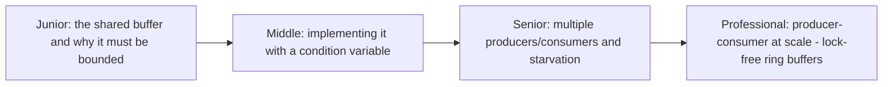

# Producer-Consumer

> One or more producers generate work; one or more consumers process it,
> through a shared, bounded buffer that coordinates the handoff. The
> pattern underneath almost every queue, pipeline, and streaming system
> covered elsewhere in this tree, at its smallest, single-process scale.

## Choose a level

| Level | Guide | You are done when |
|---|---|---|
| Junior | [The shared buffer](junior.md) | You can explain why an unbounded buffer between a fast producer and slow consumer is dangerous. |
| Middle | [Implementing with a condition variable](middle.md) | You can implement a correct bounded buffer using a mutex + condition variable. |
| Senior | [Multiple producers/consumers](senior.md) | You can explain how starvation can occur with multiple consumers competing for work. |
| Professional | [Lock-free ring buffers at scale](professional.md) | You can explain how a single-producer-single-consumer ring buffer avoids locking entirely. |

## Practice rule

Before implementing a producer-consumer buffer, ask: "what happens when
the buffer is full and a producer tries to add more, or empty and a
consumer tries to take?" Both cases need an explicit, correct wait
mechanism — get either wrong and you have a busy-wait or a deadlock.

## Related

- [Queue-Based Load Leveling](../../../../distributed-system/reliability-patterns/queue-based-load-leveling/README.md)
- [Message Queues](../../../../event-streaming/asynchronism/message-queues/README.md)
