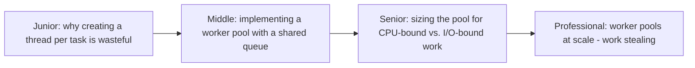
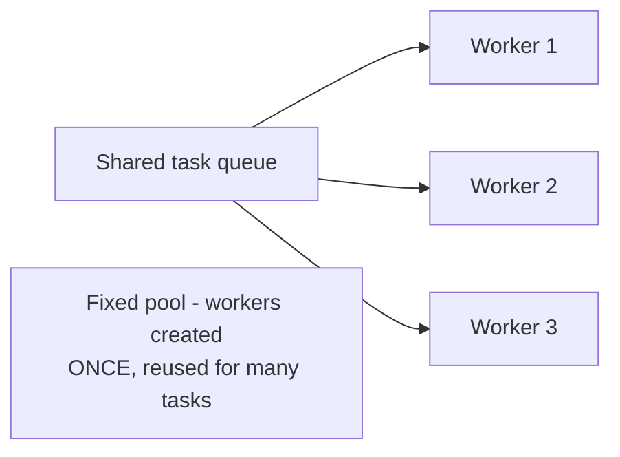

# Worker Pool

> A fixed set of long-lived workers, each pulling from a shared task
> queue — reusing threads/processes instead of creating a new one per
> task. The pattern behind every thread pool, connection pool, and task
> queue worker fleet covered elsewhere in this tree, examined at its
> simplest, most direct implementation.

## Choose a level

| Level | Guide | You are done when |
|---|---|---|
| Junior | [Why per-task threads are wasteful](junior.md) | You can explain the real cost of creating a new thread/process for every unit of work. |
| Middle | [Implementing with a shared queue](middle.md) | You can implement a basic worker pool with a fixed number of workers pulling from a shared queue. |
| Senior | [Sizing for CPU vs. I/O](senior.md) | You can size a worker pool differently for CPU-bound versus I/O-bound work. |
| Professional | [Work stealing at scale](professional.md) | You can explain how work-stealing pools rebalance load across workers automatically. |

## Practice rule

Before spawning a new thread/process for every unit of work, ask: "how
many of these will run over this program's lifetime, and how expensive
is creating one, relative to doing the actual work?" If the answer is
"many, and creation cost isn't negligible," a worker pool is the right
tool.

## Related

- [Thread Pool (04-concurrency-patterns)](../../04-concurrency-patterns/05-thread-pool/README.md)
- [Connection Pooling](../../../../databases/operation/connection-pooling/README.md)
