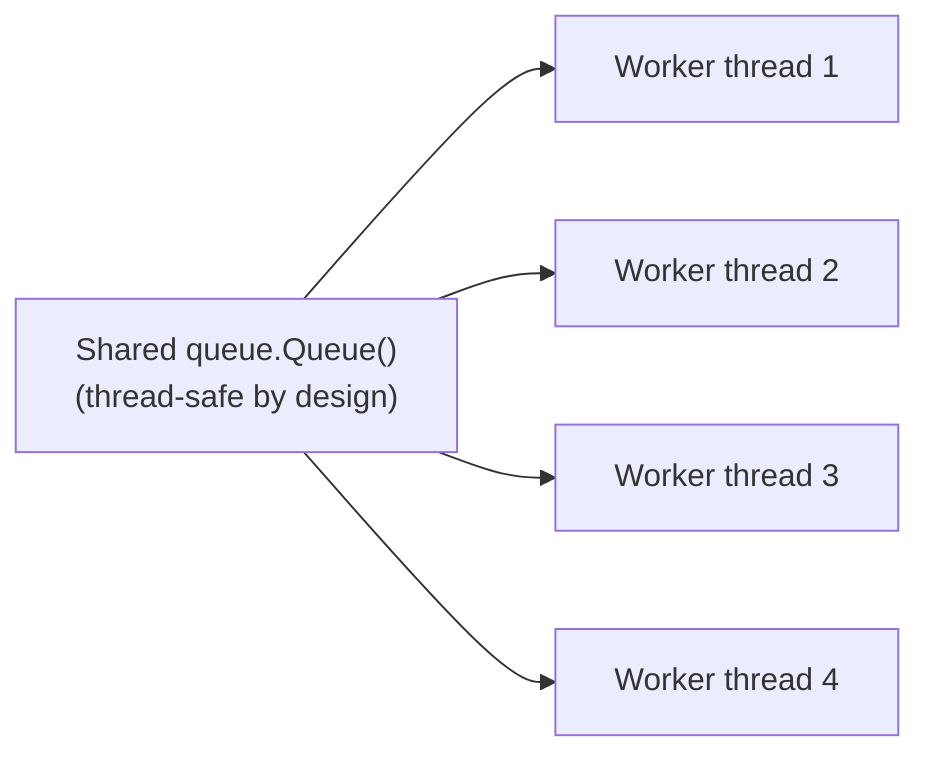

# Worker Pool — Middle

<!-- level-focus -->
At middle level, focus on this question:

> How do you implement a basic worker pool with a fixed number of workers
> pulling from a shared queue?

Prerequisite: [`junior.md`](junior.md).

---

## The implementation shape

```python
import queue
import threading

task_queue = queue.Queue()

def worker():
    while True:
        task = task_queue.get()
        if task is None:  # sentinel value to signal shutdown
            break
        process(task)
        task_queue.task_done()

# Create the pool ONCE, at startup
workers = [threading.Thread(target=worker) for _ in range(4)]
for w in workers:
    w.start()

# Submit work over time - reuses the same 4 threads
for item in incoming_items:
    task_queue.put(item)
```



The queue itself (Python's `queue.Queue`, or equivalent in other
languages) is internally synchronized — this is the exact bounded-buffer
producer-consumer mechanism from
[Producer-Consumer](../producer-consumer/README.md), reused here as
the coordination point between whoever submits work and the fixed pool of
workers consuming it.

> 🎓 **Takeaway:** a worker pool is, structurally, the producer-consumer
> pattern with a fixed-size consumer pool and a language/library-provided
> thread-safe queue doing the actual synchronization work — most
> languages provide a ready-made worker pool abstraction (Python's
> `ThreadPoolExecutor`, Java's `ExecutorService`) precisely so you don't
> need to hand-roll this queue-plus-workers pattern yourself.

## Test yourself

1. Why is the shared queue's internal thread-safety what makes this
   worker pool implementation correct, without any additional locking in
   the worker function itself?
2. Why is a `None` sentinel value a simple way to signal worker shutdown?
3. Why would you generally prefer a language's built-in thread pool
   executor (e.g. `ThreadPoolExecutor`) over hand-rolling this pattern
   yourself in production code?

Continue to [`senior.md`](senior.md).
