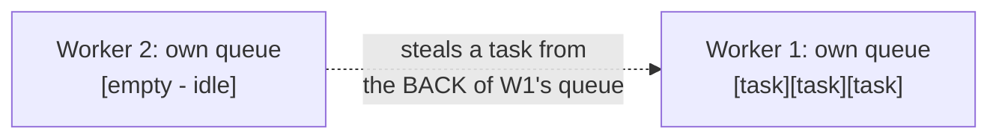
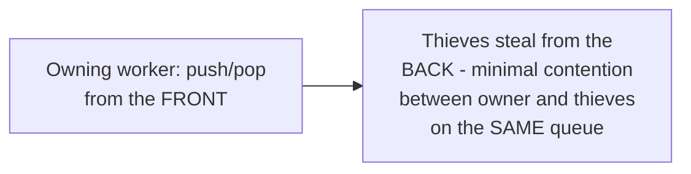

# Worker Pool — Professional

<!-- level-focus -->
At professional level, focus on this question:

> How does a work-stealing pool automatically rebalance load across
> workers when task durations are uneven, without any central scheduler
> decision per task?

Prerequisite: [`senior.md`](senior.md).

---

## The problem a single shared queue doesn't fully solve

`middle.md`'s single shared queue already distributes work reasonably
well — but under **highly uneven** task durations (some tasks take 1ms,
others take 1 second), a worker that happens to pull several long tasks
in a row falls behind, while workers who happened to pull short tasks
sit idle waiting for more work to appear in the shared queue — real,
if usually modest, load imbalance can still occur, especially at very
high worker counts where shared-queue contention itself becomes a
bottleneck.

## Work stealing: each worker has its own queue, idle workers steal from busy ones



In a **work-stealing** scheduler (used by Java's `ForkJoinPool`, Rust's
Rayon, Go's runtime scheduler for goroutines), each worker maintains its
**own** local task queue, and pushes/pops from the **front** of its own
queue normally — when a worker's own queue is empty, it **steals** a task
from the **back** of a different, busy worker's queue, rebalancing load
automatically without any central coordinator making that decision.
Stealing from the back (rather than the front) specifically minimizes
contention between the owning worker (operating on the front) and
thieves (operating on the back) — the same cache-line/contention-avoidance
principle from the Locking & Concurrency Control professional page's
false-sharing discussion, applied to queue access patterns here.



## Why this matters for recursive, divide-and-conquer workloads specifically

Work stealing is especially valuable for **recursive** parallel
workloads (a divide-and-conquer algorithm that spawns sub-tasks
recursively, per the parallel-programming topics' fork-join discussion)
where task sizes are genuinely unpredictable in advance — a single shared
queue would force every spawned sub-task through one contention point,
while work stealing lets each worker generate and consume its own
sub-tasks locally, only reaching across to another worker's queue when
genuinely idle.

## Production checklist (staff-level)

1. **Use a language/runtime's built-in work-stealing pool (ForkJoinPool,
   Rayon, Go's goroutine scheduler) for recursive/divide-and-conquer
   parallel workloads** rather than a single shared-queue pool — this is
   exactly the workload shape work stealing is designed for.
2. **Use a simpler single-shared-queue pool (`middle.md`) for
   independent, non-recursive task batches** where task durations are
   relatively uniform — work stealing's added complexity isn't justified
   when a shared queue already distributes load evenly.
3. **Never hand-implement a work-stealing scheduler from scratch** unless
   you have a very specific, well-justified reason — this is exactly the
   kind of subtle, hard-to-verify lock-free/low-contention data structure
   recommended against hand-rolling elsewhere in this tree (per the
   Skip List and Producer-Consumer professional pages' identical
   recommendation).
4. **Size pools per `senior.md`'s CPU-bound/I/O-bound distinction**
   regardless of whether you choose shared-queue or work-stealing —
   the scheduling algorithm and the pool size are separate, both-necessary
   decisions.
5. **In a performance review for a workload showing uneven worker
   utilization despite a reasonably-sized pool, consider whether the
   workload's task-duration variance suggests work stealing would help**
   — this is a specific, diagnosable signal (via per-worker utilization
   metrics) that points toward this professional-level fix.

## Cheat Sheet

```text
+------------------------------------------------------------------+
|                  WORKER POOL — INTERNALS & SCALE                    |
+------------------------------------------------------------------+
| Single shared queue: simple, works well for uniform task durations,   |
| but a real bottleneck/imbalance risk at very high worker count or     |
| with highly uneven task durations                                     |
+------------------------------------------------------------------+
| Work stealing: each worker has its OWN local queue (push/pop from      |
| the FRONT); idle workers STEAL from the BACK of a busy worker's        |
| queue - automatic load rebalancing with minimal contention (front     |
| vs. back access pattern avoids owner/thief conflicts)                 |
+------------------------------------------------------------------+
| Especially valuable for RECURSIVE/divide-and-conquer parallel          |
| workloads with unpredictable sub-task sizes (ForkJoinPool, Rayon,      |
| Go's goroutine scheduler) - use the runtime's built-in                |
| implementation, never hand-roll                                       |
+------------------------------------------------------------------+
```

## Test yourself

1. Why does stealing from the back of another worker's queue (rather than
   the front) minimize contention between the owner and thieves?
2. Why is work stealing especially well-suited to recursive,
   divide-and-conquer parallel workloads specifically?
3. Design a diagnostic approach (metrics you'd look at) to determine
   whether a production worker pool showing uneven utilization would
   benefit from switching to a work-stealing scheduler.

## Further Reading

- Blumofe & Leiserson — "Scheduling Multithreaded Computations by Work
  Stealing" (the original, foundational work-stealing paper).
- Java documentation — "ForkJoinPool" (a production work-stealing
  implementation you can inspect directly).
- See also: [Fan-Out / Fan-In — professional](../fan-in-fan-out/professional.md),
  [Locking & Concurrency Control — professional](../../../../databases/transaction/locking-and-concurrency-control/professional.md).
