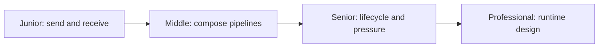
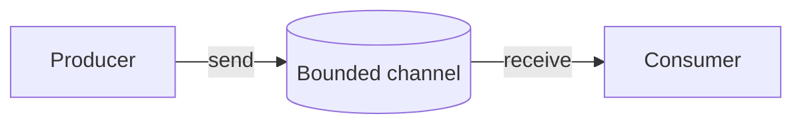

# Channels

> A channel transfers values between concurrent tasks while coordinating senders and receivers.

| Level | Guide | You are done when |
|---|---|---|
| Junior | [Start](junior.md) | You can use buffered and unbuffered channels. |
| Middle | [Apply](middle.md) | You can build cancellation-safe fan-out/fan-in. |
| Senior | [Operate](senior.md) | You can prevent leaks and overload. |
| Professional | [Design](professional.md) | You can choose channel semantics and implementation. |

**Practice rule:** The sending side owns closure; every blocked operation needs a cancellation path.

## Related

[CSP](../../models/csp/README.md) | [Message passing](../../models/message-passing/README.md)
