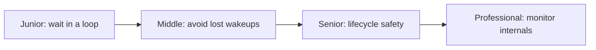
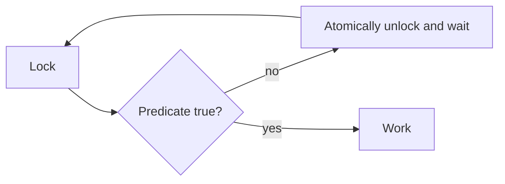

# Condition Variables

> A condition variable lets threads sleep until shared state may satisfy a predicate.

| Level | Guide | You are done when |
|---|---|---|
| Junior | [Start](junior.md) | You can wait on a predicate in a loop. |
| Middle | [Apply](middle.md) | You can signal without lost wakeups. |
| Senior | [Operate](senior.md) | You can design shutdown-safe coordination. |
| Professional | [Design](professional.md) | You can evaluate monitor implementations. |

**Practice rule:** The predicate is the truth; notification only says to check again.

## Related

[Mutex](../mutex/README.md) | [Channels](../channels/README.md)
