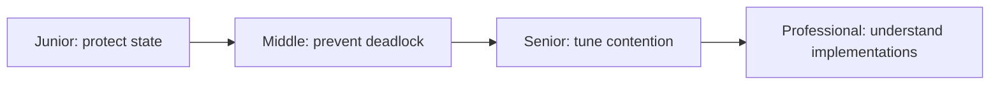
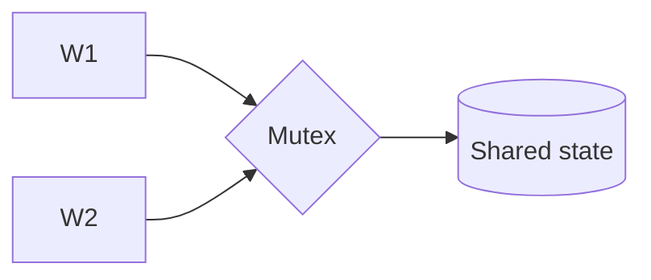

# Mutex

> A mutex lets one thread at a time enter a critical section that protects an invariant.

| Level | Guide | You are done when |
|---|---|---|
| Junior | [Start](junior.md) | You can protect one invariant safely. |
| Middle | [Apply](middle.md) | You can control scope and lock order. |
| Senior | [Operate](senior.md) | You can diagnose contention and inversion. |
| Professional | [Design](professional.md) | You can select and govern lock designs. |

**Practice rule:** Associate each mutex with a documented invariant, not a code region.

## Related

[Shared memory](../../models/shared-memory/README.md) | [Atomics](../atomic/README.md)
