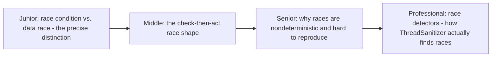
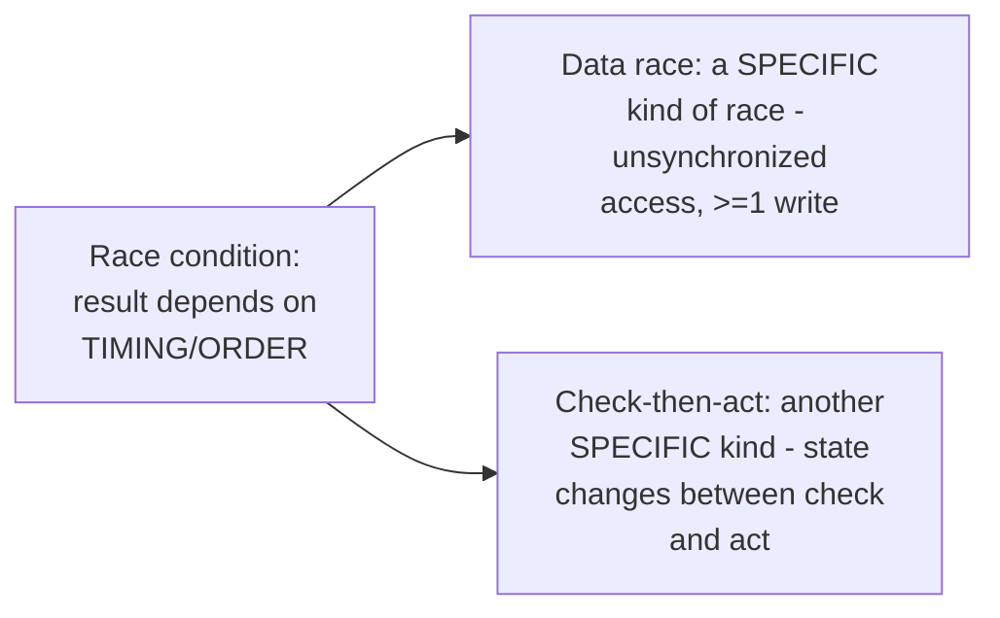

# Race Conditions

> A bug whose presence depends on the timing/interleaving of concurrent
> operations — the umbrella category that data races, lost updates, and
> check-then-act bugs (already covered in depth in this repo's Shared-
> Memory Concurrency track) all belong to. This page is the map connecting
> those specific bug shapes to the general concept, plus detection tooling.

## Choose a level

| Level | Guide | You are done when |
|---|---|---|
| Junior | [Race condition vs. data race](junior.md) | You can explain why every data race is a race condition, but not every race condition is a data race. |
| Middle | [The check-then-act shape](middle.md) | You can identify a check-then-act race in code and fix it with an atomic operation. |
| Senior | [Why races are hard to reproduce](senior.md) | You can explain why a race bug can pass every test and still fail in production. |
| Professional | [How ThreadSanitizer finds races](professional.md) | You can explain the happens-before-violation detection algorithm race detectors use. |

## Practice rule

For any shared, mutable state touched by more than one thread, ask: "is
every access to this either read-only, or protected by the same
synchronization mechanism?" If any access path skips synchronization,
you likely have a race condition waiting to manifest under the right
timing.

## Related

- [Shared-Memory Concurrency — junior](../models/shared-memory/junior.md)
- [Locking & Concurrency Control](../../../databases/transaction/locking-and-concurrency-control/README.md)
