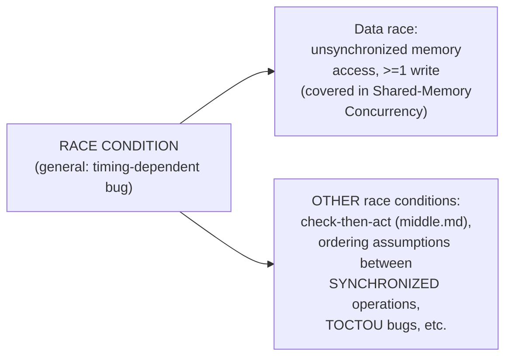

# Race Conditions — Junior

<!-- level-focus -->
At junior level, focus on this question:

> Why is every data race a race condition, but not every race condition a
> data race?

---

## Race condition: the general category

> A **race condition** is any bug whose presence or behavior depends on
> the relative timing/order of concurrent operations.

## Data race: the specific, narrower case already covered in depth

The [Shared-Memory Concurrency — junior](../models/shared-memory/junior.md)
page already covers **data races** precisely: two threads accessing the
same memory address, with no synchronization, at least one of them
writing. That's the classic `counter++` bug.



## A race condition WITHOUT a data race

```python
# Both accesses are individually "thread-safe" (a lock protects each one) -
# NO data race - but the OVERALL operation still has a race condition:
with lock:
    if not cache.contains(key):
        pass  # check
# <-- ANOTHER thread could insert the key HERE, between check and act
with lock:
    cache.put(key, compute_value())  # act - might overwrite,
                                       # or duplicate work needlessly
```

This is exactly the compound-operation trap from
[Shared-Memory Concurrency — junior](../models/shared-memory/junior.md)'s
edge cases section — each individual `cache` operation is properly
synchronized (no data race on `cache` itself), but the **combination** of
two synchronized operations, with a gap between them, is still a race
condition: the overall result depends on whether another thread acts
during that gap.

> 🎓 **Takeaway:** "data race" refers to a specific low-level memory-access
> pattern; "race condition" is the broader, more general concept covering
> any timing-dependent bug — including bugs that occur even when every
> individual memory access is perfectly synchronized.

## Test yourself

1. Why can a "thread-safe" cache (every individual method properly
   locked) still have race conditions in code that calls it?
2. Give an example of a race condition that involves no shared memory
   access at all (hint: think about two processes coordinating via
   external state, like a file's existence).
3. Why is it imprecise to say "we don't have any data races, so our code
   is race-condition-free"?

Continue to [`middle.md`](middle.md).
