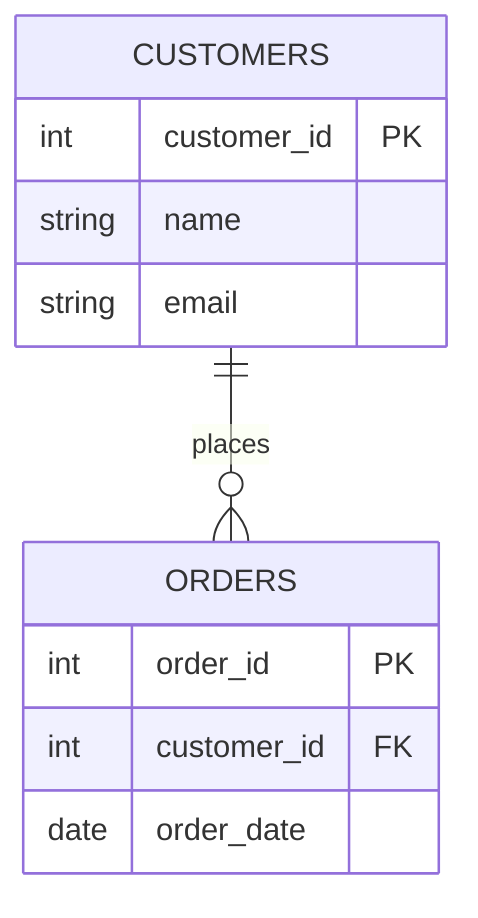

# Relational Model — Junior

<!-- level-focus -->
At junior level, focus on this question:

> What is a table, a key, and why does splitting data into multiple tables
> actually make it *more* correct, not just tidier?

---

## Tables, rows, keys

A relational database stores data as **tables**: fixed columns, many rows.
Every row needs a **primary key (PK)** — a column (or set of columns) that
uniquely identifies it. Other tables reference that row via a **foreign key
(FK)** — a column holding the PK value of a row in another table.



`orders.customer_id` doesn't repeat the customer's name and email — it just
points at `customers.customer_id`. That pointer, not a copy, is the
relationship.

## Why not just use one big flat table?

Imagine one table with every order row also carrying `customer_name`,
`customer_email`:

| order_id | customer_id | customer_name | customer_email | order_date |
|---|---|---|---|---|
| 1 | 42 | Alice | alice@x.com | 2024-01-01 |
| 2 | 42 | Alice | alice@x.com | 2024-01-05 |
| 3 | 42 | Alice | alice@x.com | 2024-02-01 |

This is the **anomaly-generating shape**. Three problems:

- **Update anomaly** — Alice changes her email. You must update it in every
  row that mentions her, or the table now disagrees with itself.
- **Insert anomaly** — you can't record that Alice exists until she places an
  order, because "customer" isn't its own row anywhere.
- **Delete anomaly** — deleting Alice's only order also deletes the only
  record that she's a customer at all.

Splitting `customers` out and referencing it by `customer_id` fixes all
three: Alice's email lives in exactly one row, one place, one fact.

> 🎓 **Takeaway:** normalization is not aesthetics. It exists so that every
> fact is stored **exactly once**, which is what makes updates safe.

## Reading the model back with a join

```sql
SELECT o.order_id, c.name, o.order_date
FROM orders o
JOIN customers c ON o.customer_id = c.customer_id;
```

The database re-assembles the "flat" view on demand by matching FK to PK. You
pay this join cost at **read time** in exchange for paying **zero** anomaly
risk at write time. That trade-off is the whole subject of `middle.md`.

## Test yourself

1. In the anomaly table above, name a query that would silently return wrong
   results if only *one* of Alice's three rows got her email update.
2. Why is a foreign key a *reference*, not a copy? What would break if it were
   a copy?
3. A junior teammate proposes storing `product_name` directly on every
   `order_items` row "to avoid a join." What future bug are they introducing?

Continue to [`middle.md`](middle.md).
