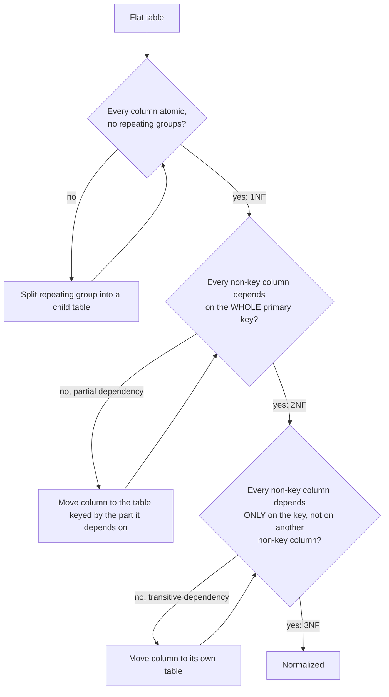

# Relational Model — Middle

<!-- level-focus -->
At middle level, focus on this question:

> What do the normal forms actually check for, and what does normalizing a
> table cost you at query time?

Prerequisite: [`junior.md`](junior.md).

---

## The normal forms, as checklists

You rarely recite formal definitions on the job — you run these checks:



| Form | Rule of thumb | Example violation |
|---|---|---|
| **1NF** | Each cell holds one value; no comma-separated lists in a column. | `phone_numbers = "555-1111,555-2222"` in one cell. |
| **2NF** | (Only matters with composite keys) every column depends on the *whole* key, not just part of it. | `order_items(order_id, product_id, product_name)` — `product_name` only depends on `product_id`, not on `order_id` too. |
| **3NF** | No column depends on another non-key column ("transitive dependency"). | `orders(order_id, customer_id, customer_city)` — `customer_city` depends on `customer_id`, not on `order_id`. |

## Worked example: normalizing to 3NF

Start flat:

```
orders_flat(order_id, customer_id, customer_name, customer_city,
            product_id, product_name, product_price, quantity)
```

Apply the checklist and split:

```sql
CREATE TABLE customers (
    customer_id INT PRIMARY KEY,
    name TEXT,
    city TEXT
);

CREATE TABLE products (
    product_id INT PRIMARY KEY,
    name TEXT,
    price NUMERIC
);

CREATE TABLE orders (
    order_id INT PRIMARY KEY,
    customer_id INT REFERENCES customers(customer_id),
    order_date DATE
);

CREATE TABLE order_items (
    order_id INT REFERENCES orders(order_id),
    product_id INT REFERENCES products(product_id),
    quantity INT,
    PRIMARY KEY (order_id, product_id)
);
```

Now `customer_city` lives once, in `customers`. `product_price` lives once, in
`products`. Every anomaly from `junior.md` is structurally impossible.

## What this costs you

To reconstruct "orders with customer city and product names," you now need a
**3-table join**:

```sql
SELECT o.order_id, c.city, p.name, oi.quantity
FROM orders o
JOIN customers c ON o.customer_id = c.customer_id
JOIN order_items oi ON oi.order_id = o.order_id
JOIN products p ON p.product_id = oi.product_id;
```

Each join is a real cost: the query planner must find matching rows (via an
index or a hash/merge join), and more joins generally means more I/O and CPU
per query. For a **transactional** system taking one order at a time, this
cost is negligible against the correctness it buys. For an **analytical**
query scanning millions of rows and doing this join repeatedly, it adds up —
which is exactly why data warehouses often **denormalize on purpose**
(covered in `senior.md`).

## Test yourself

1. Is `order_items(order_id, product_id, product_name)` in 1NF? In 2NF? Which
   rule does it violate and why?
2. Rewrite a table `employees(emp_id, dept_id, dept_manager)` to 3NF. What's
   the transitive dependency?
3. Why does a composite primary key matter for spotting 2NF violations, but
   not 3NF violations?
4. In the worked example, which join would you expect an index to help most,
   and why?

Continue to [`senior.md`](senior.md).
