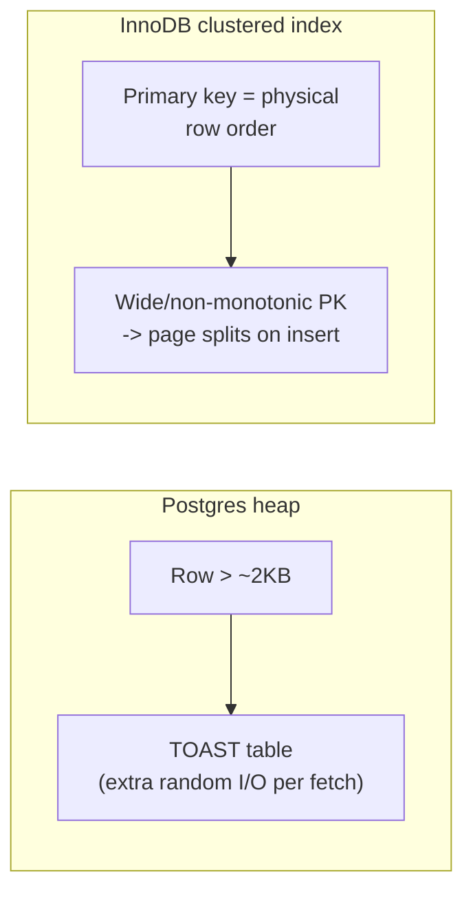

# Relational Model — Professional

<!-- level-focus -->
At professional level, focus on this question:

> What actually happens on disk and in memory when you normalize or
> denormalize a schema, and how do storage-engine internals change the
> calculus at scale?

Prerequisite: [`senior.md`](senior.md).

---

## Heap files, TOAST, and row layout: what normalization costs in bytes

Postgres stores each table as a **heap file**: an unordered sequence of fixed
8 KB pages, each holding a page header, an item pointer array (`ItemId`
entries), and tuples growing backward from the end of the page. A row wider
than roughly 2 KB triggers **TOAST** (The Oversized-Attribute Storage
Technique): large column values are compressed and/or moved out-of-line into
a side table (`pg_toast.pg_toast_<oid>`), leaving only a pointer in the main
tuple. A denormalized, very-wide row is not just "more bytes" — it's more
tuples that spill into TOAST, each TOAST fetch being an **extra random I/O**
on top of the main heap read, silently reintroducing the exact join-style
random-access cost denormalization was supposed to eliminate.

MySQL's InnoDB instead stores tables as **clustered indexes**: the primary
key *is* the physical row order (a B+Tree leaf holds the full row, keyed by
PK). This has a direct modeling consequence: a normalized child table with a
monotonic surrogate PK gets excellent insert locality (see the B+Tree
professional page), while a denormalized wide table with a large PK or a
non-monotonic natural key pays page-split cost on every insert, at
InnoDB's `innodb_page_size` (default 16 KB) granularity.



## The buffer pool is the real arena for this trade-off

Normalization vs. denormalization is, underneath everything, a bet about
**buffer pool (page cache) hit rate**. A normalized schema's small,
frequently-reused dimension rows (e.g. `customers`) stay resident in the
buffer pool because they're small and hot; a denormalized wide table forces
more distinct pages into the pool for the same logical dataset, increasing
eviction pressure and pushing genuinely hot pages out under `LRU`-style
(or Postgres's clock-sweep) buffer replacement. At scale, the operative
metric is not "how many joins" but **`buffer_cache_hit_ratio`** and, more
precisely, **pages read from disk per transaction** — a query plan with two
extra joins against fully-cached dimension tables can be cheaper than one
without joins against a table too wide to stay cached.

## Concurrency control interacts with schema shape, not just isolation level

A normalized schema concentrates writes into narrow rows — under MVCC
(Postgres) this means smaller, more numerous dead tuples per logical update,
which is cheap for `autovacuum` to reclaim per-tuple but requires more
frequent vacuum cycles at high update rates. A denormalized wide row means
**every logical field update rewrites the entire wide tuple** (Postgres has
no in-place partial-tuple update — MVCC always writes a new full tuple
version), so a schema that denormalizes a frequently-updated field into a
wide, rarely-updated table multiplies write amplification and bloat
per update by the width of that row. This is a direct, measurable interaction
between §[MVCC](../../transaction/10-mvcc/professional.md) internals and
schema design that most modeling guidance ignores entirely.

## Scale failure modes, concretely

| Symptom at 10x scale | Root cause | Diagnostic |
|---|---|---|
| Join latency degrades superlinearly, not linearly, with row count | A join's inner side no longer fits in the buffer pool; each probe becomes a random disk read instead of a memory hit | `EXPLAIN (ANALYZE, BUFFERS)` — watch `shared read` climb relative to `shared hit` |
| Denormalized table's write throughput collapses under concurrent updates | Full-tuple MVCC rewrites of a wide row create lock contention and bloat far beyond what the logical update size suggests | `pg_stat_user_tables.n_dead_tup` growing faster than `n_tup_upd` would predict |
| A "simple" normalized schema starts timing out on 5-table joins under load | Buffer pool thrashing: the working set across all five tables together no longer fits in `shared_buffers`, and each table individually still looks small | Compare `pg_statio_user_tables` heap-blocks-read vs. heap-blocks-hit across all joined tables together, not per-table |

## Production checklist (staff-level)

1. **Model against the buffer pool's real size, not "does this look
   normalized."** If your combined working set (hot rows across all tables
   touched by your top N queries) exceeds cache size, normalization's read
   cost model breaks down regardless of how textbook-correct the schema is.
2. **Treat TOAST/off-page storage as a first-class cost** for any wide
   table design — measure `pg_stat_user_tables` and `pg_total_relation_size`
   including TOAST, not just the main relation size.
3. **Model update frequency per column, not just per table**, before
   denormalizing — a rarely-updated wide table is cheap; a frequently-updated
   wide table multiplies MVCC/undo-log write amplification by its width.
4. **In a design review, ask for the physical row size and expected update
   rate**, not just the logical schema — these two numbers predict the real
   production cost of a modeling decision far better than normal-form
   compliance alone.
5. **Instrument buffer cache hit ratio and dead-tuple growth as leading
   indicators**, alerting before they become query-latency incidents — by
   the time joins are slow, the buffer pool has already been thrashing for a
   while.

## Cheat Sheet

```text
+------------------------------------------------------------------+
|            RELATIONAL MODEL — INTERNALS & SCALE                     |
+------------------------------------------------------------------+
| Postgres: heap file, 8KB pages, TOAST for wide rows (extra I/O)      |
| InnoDB: clustered index, PK IS physical order -> PK shape matters     |
+------------------------------------------------------------------+
| Real cost model = buffer pool hit rate, not "is it normalized"        |
|   small hot dimension tables stay cached -> joins are cheap           |
|   wide denormalized tables evict more pages -> joins get expensive    |
+------------------------------------------------------------------+
| MVCC writes a FULL new tuple on any update - denormalizing a          |
| frequently-updated field into a wide row multiplies write             |
| amplification and vacuum/bloat pressure by the row's width            |
+------------------------------------------------------------------+
| Diagnose at scale with EXPLAIN (ANALYZE, BUFFERS), pg_statio_*,       |
| and dead-tuple growth rate - not row counts or normal-form theory     |
+------------------------------------------------------------------+
```

## Test yourself

1. A table normalized to 3NF starts showing superlinear join latency growth
   as row count increases 10x. Using buffer pool reasoning, explain why this
   isn't necessarily a "need more indexes" problem.
2. Why does denormalizing a frequently-updated column into a wide table cost
   more under MVCC than the same denormalization for a rarely-updated column,
   even though the logical schema change looks identical?
3. In a design review, a wide table is proposed with 40 columns, one of which
   (`status`) changes 100 times more often than the rest. What would you ask
   before approving it?

## Further Reading

- PostgreSQL source/documentation — "Database Page Layout," "TOAST," and
  "Free Space Map" (the physical storage internals referenced above).
- Jim Gray & Andreas Reuter — *Transaction Processing: Concepts and
  Techniques* (buffer management theory).
- Percona Engineering blog — InnoDB clustered index and page-split
  postmortems under high-write workloads.
- See also: [MVCC — professional](../../transaction/10-mvcc/professional.md),
  [B+Tree — professional](../../performance/14-indexing%20%26%20filtering/b+tree/professional.md).
