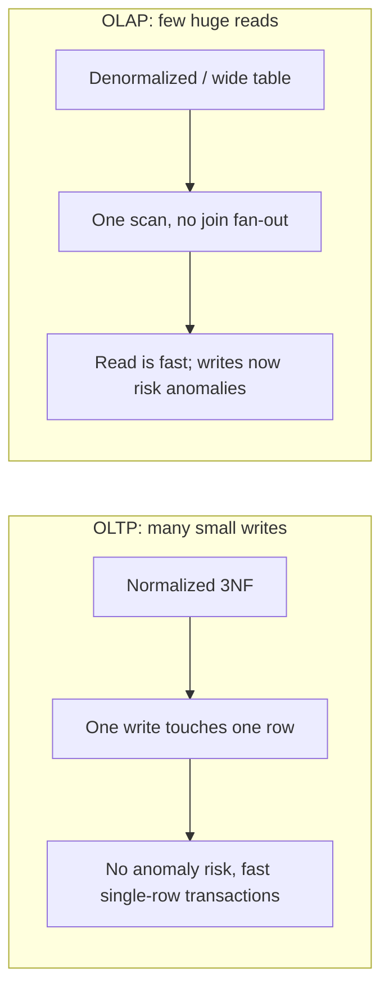

# Relational Model — Senior

<!-- level-focus -->
At senior level, focus on this question:

> When is denormalization the *correct* engineering choice, and what do you
> give up when you make it?

Prerequisite: [`middle.md`](middle.md).

---

## Normalize for writes, denormalize for reads



A normalized schema optimizes for **write correctness under concurrency** — a
single order insert touches `orders` and `order_items`, not a sprawling wide
row. A denormalized schema optimizes for **read throughput** — a single scan
answers a report without a five-table join.

The senior-level move is recognizing these are **different workloads that
want different shapes**, not "one true way to model data." A production
system usually needs both: a normalized OLTP schema as the source of truth,
and a denormalized (or star-schema, see `kimball-modeling/`) copy for
analytics — connected by an ETL/ELT pipeline.

## Concurrency cost of normalization

Every join at read time is also a **lock/MVCC-snapshot cost** at read time
under concurrent writers. A 3-table join under `REPEATABLE READ` or
`SERIALIZABLE` isolation may need to reconcile snapshots across three tables
being modified concurrently — this is where isolation levels
(`../../transaction/08-isolation-levels/`) and normalization intersect. A
denormalized row, by contrast, is a **single row** — one snapshot, one lock,
simpler concurrency story, at the price of update anomalies you must now
manage explicitly (usually by making the wide table derived/read-only, never
hand-edited).

## Concrete trade-off: a materialized denormalized view

```sql
CREATE MATERIALIZED VIEW order_summary AS
SELECT o.order_id, c.name AS customer_name, c.city,
       p.name AS product_name, oi.quantity, p.price * oi.quantity AS line_total
FROM orders o
JOIN customers c ON o.customer_id = c.customer_id
JOIN order_items oi ON oi.order_id = o.order_id
JOIN products p ON p.product_id = oi.product_id;
```

This is denormalization *done safely*: the wide, anomaly-prone shape exists
only as a **derived, refreshable artifact**. The source of truth stays
normalized. Nobody writes directly to `order_summary`; it's rebuilt (fully or
incrementally) from the normalized tables. This is the same principle behind
every downstream dbt model, Spark job, or CDC-fed analytics table: **keep the
anomaly-prone wide shape downstream and disposable, never upstream and
authoritative.**

## Test yourself

1. Why is `REPEATABLE READ` more expensive to guarantee across a 3-table join
   than across a single-table read?
2. Explain why `order_summary` above is safe to denormalize even though it
   violates 3NF — what property makes it safe?
3. A team wants to let analysts write corrections directly into a wide
   denormalized reporting table. What anomaly risk are they reintroducing, and
   what would you propose instead?
4. Give one workload where you would keep even an analytical table normalized
   (i.e., resist denormalizing).

Continue to [`professional.md`](professional.md) to see how a source system's
relational schema shapes the ingestion pipeline built on top of it.
