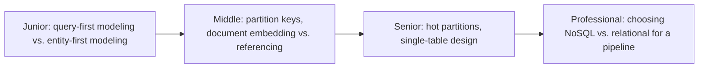

# NoSQL Modeling

> Model data around your access patterns, not around eliminating duplication.
> DynamoDB, Cassandra, MongoDB, and wide-column stores all invert the
> relational rule: denormalize by design, and let the query dictate the schema.



```mermaid
flowchart LR
    Q[Access pattern: "get all orders for a customer"] --> PK["Partition key = customer_id"]
    PK --> Item1[Item: ORDER#1]
    PK --> Item2[Item: ORDER#2]
    PK --> Item3[Item: PROFILE]
```

## Choose a level

| Level | Guide | You are done when |
|---|---|---|
| Junior | [Query-first vs. entity-first modeling](junior.md) | You can explain why you design a NoSQL schema by listing queries first, not entities first. |
| Middle | [Partition keys, embedding, and referencing](middle.md) | You can choose a partition key for a given access pattern and decide when to embed vs. reference. |
| Senior | [Hot partitions and single-table design](senior.md) | You can diagnose a hot-partition problem and explain single-table design trade-offs. |
| Professional | [Choosing the right store for a pipeline](professional.md) | You can pick between relational, document, key-value, and wide-column stores for a given ingestion/serving workload. |

## Practice rule

Before modeling anything in a NoSQL store, write down every query your
application needs to run — in plain English — before you write a single
schema field. If you can't list the queries, you can't model the data.

## Related

- [Relational Model](../01-relational-model/README.md)
- [Partitioning & Sharding](../../scaling/17-partitioning-and-sharding/README.md)
- [Kimball Dimensional Modeling](../kimball-modeling/README.md)
