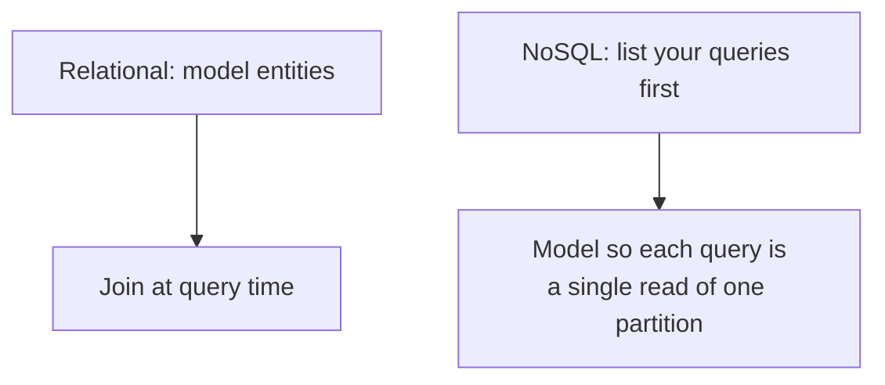

# NoSQL Modeling — Junior

<!-- level-focus -->
At junior level, focus on this question:

> Why does NoSQL modeling start from "what queries do I need?" instead of
> "what entities exist?"

---

## The relational habit that doesn't transfer

In a relational database, you model entities (`customers`, `orders`,
`products`), normalize them, and let the query engine join whatever you need
at read time — see [Relational Model](../01-relational-model/junior.md). Joins
are cheap to *express*; the engine figures out the plan.

Most NoSQL stores (DynamoDB, Cassandra, MongoDB, HBase) either don't support
joins at all, or make them expensive/discouraged. If you model entities first
and then try to "join" `customers` and `orders` at query time, you'll either
run N+1 queries or hit a wall.

## Query-first modeling, concretely

Say your app needs exactly these two queries:

1. "Get a customer's profile."
2. "Get all of a customer's orders, most recent first."

In DynamoDB-style modeling, you design a table where **both queries are a
single partition read**:

| PK (partition key) | SK (sort key) | attributes |
|---|---|---|
| `CUSTOMER#42` | `PROFILE` | name, email |
| `CUSTOMER#42` | `ORDER#2024-02-01#7` | total, items |
| `CUSTOMER#42` | `ORDER#2024-01-05#3` | total, items |

Both queries above become: "give me everything under partition key
`CUSTOMER#42`, optionally filtered by sort-key prefix." No join, no second
table — because you designed the **table** around the **query**, not around
the "customer" and "order" entities as separate things.

> 🎓 **Takeaway:** in relational modeling, the schema is entity-shaped and the
> query does the work. In NoSQL modeling, the *query* is what shapes the
> schema. If your access pattern changes, you often need to remodel the table,
> not just write a new query.

## Test yourself

1. Why would `SELECT * FROM orders WHERE customer_id = 42` (a relational
   pattern) be a bad instinct to bring into a DynamoDB schema design session?
2. In the table above, what does the sort key `ORDER#2024-02-01#7` buy you
   that a plain `ORDER#7` wouldn't?
3. A new requirement appears: "get all orders placed on 2024-02-01, across all
   customers." Can the table above answer that efficiently? Why or why not?

Continue to [`middle.md`](middle.md).
