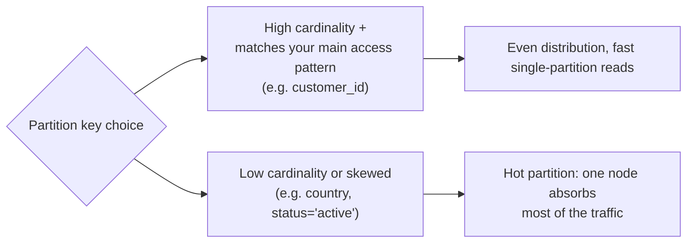

# NoSQL Modeling — Middle

<!-- level-focus -->
At middle level, focus on this question:

> How do you choose a partition key, and when do you embed data vs. reference
> it by ID?

Prerequisite: [`junior.md`](junior.md).

---

## Choosing a partition key

The partition key decides which items are stored (and read) together, and it
is the axis the store uses to distribute data across nodes.



Rules of thumb:

- Pick the key that answers your **most frequent** query with a single
  partition read (from `junior.md`: `customer_id` if "get a customer's data"
  dominates).
- Prefer **high-cardinality** values (user IDs, order IDs) over low-cardinality
  ones (`status`, `country`, `is_active`) — low cardinality means a handful of
  partitions absorb almost all the traffic (a "hot partition," covered in
  `senior.md`).
- If you need a second access pattern (e.g. "find orders by date across all
  customers"), you generally need a **secondary index** or a **denormalized
  copy** in a second table — not a join.

## Embedding vs. referencing (document stores)

In a document store (MongoDB, DynamoDB items), you choose per-relationship
whether to nest data inline ("embed") or store an ID and fetch separately
("reference").

```json
// Embedded — one read gets everything
{
  "order_id": "7",
  "customer": { "name": "Alice", "email": "alice@x.com" },
  "items": [{"product": "Widget", "qty": 2}]
}
```

```json
// Referenced — two reads, but customer data isn't duplicated 1000x
{
  "order_id": "7",
  "customer_id": "42",
  "items": [{"product_id": "9", "qty": 2}]
}
```

| Choose | When |
|---|---|
| **Embed** | The nested data is small, read together with the parent almost always, and doesn't change independently often (e.g. an order's line items). |
| **Reference** | The nested data is large, shared across many parents, or changes independently (e.g. a customer referenced by thousands of orders — embedding would mean updating thousands of documents when the customer's email changes). |

This is the same anomaly trade-off from the relational model
(`../01-relational-model/junior.md`), just made explicit and manual instead of
enforced by normal forms — NoSQL gives you the rope; you decide whether to use
it as a ladder or a noose.

## Test yourself

1. You're modeling a blog: posts and comments. Comments are read together
   with their post almost always, and never independently. Embed or
   reference? Why?
2. Why is `status` (e.g. `pending`/`shipped`/`delivered`) a poor choice of
   partition key even though it's a real, frequently-filtered field?
3. If you embed customer data into every order document, what happens the
   moment a customer changes their email? Compare this to the relational
   update anomaly from `01-relational-model/junior.md`.

Continue to [`senior.md`](senior.md).
