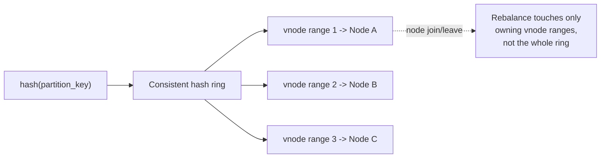

# NoSQL Modeling — Professional

<!-- level-focus -->
At professional level, focus on this question:

> How do the internal data structures of real distributed stores (consistent
> hashing rings, LSM-trees, gossip-based membership) determine what "good"
> key design actually means, and what breaks first at scale?

Prerequisite: [`senior.md`](senior.md).

---

## Consistent hashing is why partition key choice is irreversible-ish

DynamoDB and Cassandra both place partitions on a ring via consistent
hashing: `hash(partition_key) mod 2^n` (or a full 128/160-bit hash space)
determines which physical node(s) own a key. Cassandra additionally uses
**virtual nodes (vnodes)** — each physical node owns many small, randomly
distributed ranges on the ring instead of one large contiguous range —
specifically to spread the *rebalancing* cost of adding/removing a node
across the whole cluster rather than concentrating it on ring-neighbors.

The staff-level implication: a poor partition key choice isn't a
configuration you tune later — it's baked into the physical data
distribution. Reworking it means a **full data migration** (rewrite every
item under a new key), not a settings change. This is why "list your queries
first" (junior.md) is not pedagogy — it's the only lever you have before the
cost of being wrong becomes a migration project.



## LSM-trees, compaction, and why "just add fields" isn't free

Cassandra, RocksDB-backed stores, and DynamoDB's underlying storage are all
LSM-tree based (see the LSM-Tree deep dive): writes land in an in-memory
memtable, flush to immutable SSTables, and a background **compaction**
process merges SSTables to reclaim space from overwrites/tombstones. Two
professional-level consequences for modeling:

- **Wide rows with many small attributes generate more tombstones on
  partial updates/deletes** (each attribute update in Cassandra is a new
  cell version; a delete writes a tombstone per cell, not per row) —
  a table modeled with many independently-updated attributes on one wide
  partition can suffer **read-path tombstone scanning** (`tombstone_warn_threshold`
  / `tombstone_failure_threshold` in Cassandra) long before it looks large in
  raw byte count.
- **Compaction strategy must match your access pattern, not just your
  schema.** Size-Tiered Compaction Strategy (STCS) suits write-heavy,
  rarely-read-back data; Leveled Compaction Strategy (LCS) suits read-heavy
  workloads with bounded per-read SSTable counts at the cost of more total
  I/O from compaction. Choosing STCS for a read-heavy key-value model (or
  vice versa) is a data-modeling decision disguised as a storage-engine
  config flag.

## Gossip, hinted handoff, and the real meaning of "eventually"

Cassandra's cluster membership and failure detection run on a **gossip
protocol** (each node exchanges state with a few random peers per round,
propagating cluster-wide knowledge in O(log N) rounds) combined with a
**Phi Accrual failure detector** (a continuous suspicion score, not a binary
up/down). When a node is down, writes destined for it are buffered as
**hinted handoffs** by a coordinator and replayed once it returns — up to
`max_hint_window_in_ms` (default 3 hours), after which hints are dropped and
that replica genuinely diverges until **read repair** or `nodetool repair`
reconciles it. The professional-level point: "eventually consistent" has an
actual, config-driven upper bound in real systems, and that bound is an
operational parameter you own, not a property of the CAP theorem in the
abstract.

## Scale failure modes, concretely

| Symptom at 10x-100x scale | Root cause | Diagnostic |
|---|---|---|
| p99 latency spikes on one node while cluster average looks fine | Consistent-hashing skew from a low-cardinality or hot partition key concentrating load on a few vnode ranges | Per-node/per-vnode request rate distribution, not cluster-average QPS |
| Read latency degrades on a partition that "isn't even that big" | Tombstone accumulation on a wide row with frequent partial deletes, forcing the read path to scan and discard many tombstones before returning live data | Cassandra `tombstone_warn_threshold` logs; `nodetool tablestats` tombstone ratio |
| Compaction falls permanently behind, disk usage grows unbounded | Wrong compaction strategy for the write/read ratio, or a key design generating excessive small SSTables (e.g. very high write fan-out into many partitions with low per-partition data) | `nodetool compactionstats` pending compactions trending up over time, not just a momentary backlog |
| A repair after a multi-hour outage takes longer than the outage itself | Hint window exceeded during the outage; full `nodetool repair` (Merkle-tree comparison across replicas) required instead of hinted-handoff replay | Compare outage duration against `max_hint_window_in_ms`; repair duration scales with dataset size via Merkle tree depth |

## Production checklist (staff-level)

1. **Model the partition key against the ring's rebalancing cost, not just
   query shape** — assume a bad choice requires a full migration, and budget
   the decision's review accordingly (this is a one-way door more often than
   a relational schema decision is).
2. **Pick compaction strategy deliberately, per table, based on
   write:read ratio and update pattern** — never leave it at a store's
   default without checking it matches the actual workload.
3. **Treat tombstone accumulation as a first-class modeling risk** for any
   design with frequent partial updates/deletes on wide partitions — model
   TTLs and deletion patterns explicitly, don't discover this in production.
4. **Know your hint window and repair cadence as an SLA input**, not just an
   ops detail — an outage longer than the hint window converts a cheap
   hinted-handoff catch-up into an expensive full anti-entropy repair.
5. **In a design review, ask for expected per-partition-key cardinality and
   write skew (Zipfian coefficient if known)** before approving a key
   design — this number predicts ring-level hot-spotting far better than
   inspecting the schema alone.

## Cheat Sheet

```text
+------------------------------------------------------------------+
|              NOSQL MODELING — INTERNALS & SCALE                     |
+------------------------------------------------------------------+
| Consistent hashing + vnodes: partition key choice is baked into        |
| PHYSICAL placement - a bad choice needs a full migration, not a       |
| config change                                                         |
+------------------------------------------------------------------+
| LSM-tree storage: writes -> memtable -> SSTable -> compaction          |
|   STCS: write-heavy, rarely-reread    LCS: read-heavy, bounded I/O     |
|   wrong strategy for your workload = compaction falls behind           |
+------------------------------------------------------------------+
| Wide partitions + frequent partial deletes = tombstone accumulation    |
| -> read-path scans discard tombstones before returning live data       |
+------------------------------------------------------------------+
| Gossip + Phi Accrual failure detector + hinted handoff:                |
|   "eventually consistent" has a REAL bound = hint window (e.g. 3h)     |
|   exceed it -> full Merkle-tree repair required, not cheap replay      |
+------------------------------------------------------------------+
```

## Test yourself

1. A Cassandra table's read latency degrades even though its total data
   volume is unremarkable. What two mechanisms from this page would you
   check before suspecting hardware?
2. Why is choosing the wrong compaction strategy effectively a data-modeling
   mistake, not just a tuning knob?
3. An outage lasts 4 hours against a 3-hour hint window. What operational
   consequence follows, and how would you have sized the hint window
   differently given this system's actual outage history?

## Further Reading

- DeCandia et al. — "Dynamo: Amazon's Highly Available Key-value Store"
  (the original paper behind consistent hashing, vector clocks, hinted
  handoff, and read-repair in this design space).
- Apache Cassandra documentation — "Compaction" and "Gossip" (the specific
  mechanisms referenced above, with real config parameters).
- Avinash Lakshman & Prashant Malik — "Cassandra: A Decentralized Structured
  Storage System" (original Cassandra paper).
- See also: [LSM-Tree — professional](../../performance/14-indexing%20%26%20filtering/lsm-tree/professional.md),
  [BASE & Eventual Consistency — professional](../../transaction/11-base-and-eventual-consistency/professional.md).
