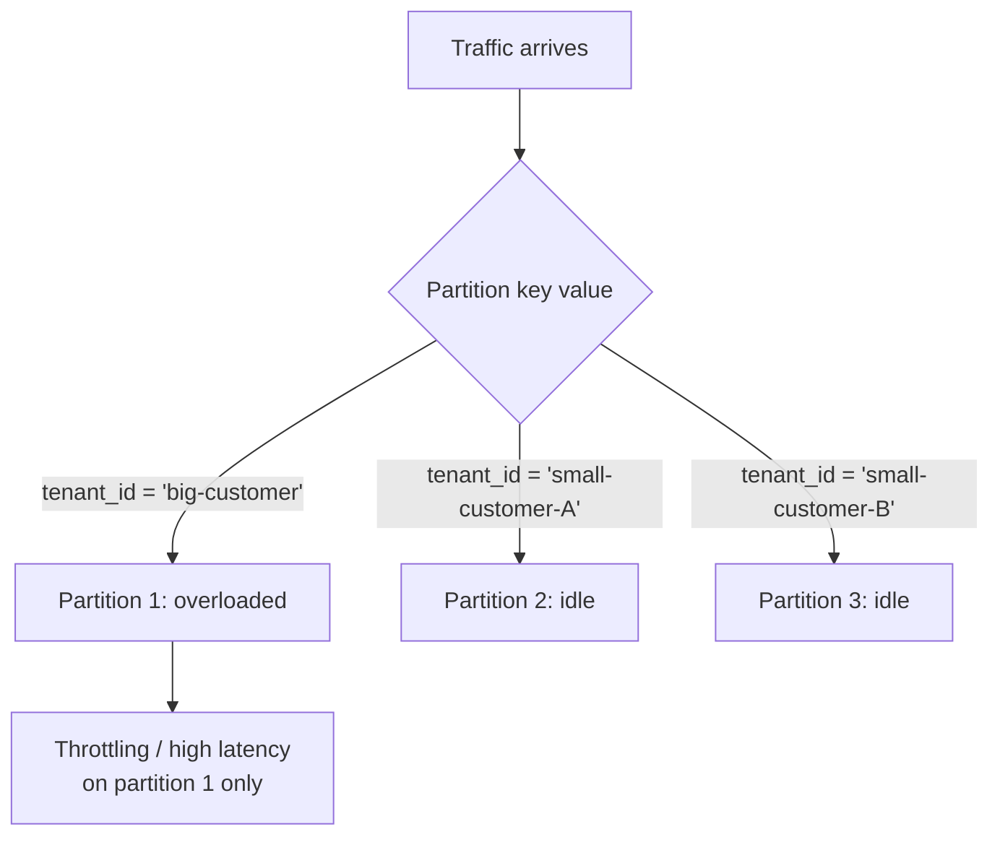

# NoSQL Modeling — Senior

<!-- level-focus -->
At senior level, focus on this question:

> How do you diagnose and prevent a hot partition, and what is "single-table
> design" actually trading off?

Prerequisite: [`middle.md`](middle.md).

---

## Hot partitions

A **hot partition** happens when one partition-key value gets disproportionate
traffic — a celebrity user, a huge tenant in a multi-tenant system, a globally
popular product. Because most NoSQL stores throttle or rate-limit **per
partition**, one hot key can degrade latency for that key while the rest of
the cluster sits idle — a very different failure mode from a relational
database, where a hot row mostly costs lock contention, not throughput
starvation.

**Mitigations:**

- **Write sharding / salting**: append a random or hashed suffix to the hot
  key (`tenant_id#0`..`tenant_id#9`) and fan reads out across all shards,
  merging results at the application layer.
- **Composite keys that spread load**: combine the hot dimension with a
  naturally high-cardinality one (`tenant_id#user_id`) so no single physical
  partition absorbs the whole tenant's traffic.
- **Caching in front of the hot key** so the partition sees read-through
  traffic only on cache misses.

## Single-table design

A DynamoDB idiom: put every entity type (customers, orders, products) into
**one physical table**, distinguished by prefixed keys (`CUSTOMER#42`,
`ORDER#7`, `PRODUCT#9`), so that most access patterns — including patterns
that would otherwise be "joins" across entity types — become a single query
against one partition.

| Pros | Cons |
|---|---|
| Fewer round trips; most access patterns are one query. | Schema is opaque — you can't tell what's in the table by looking at it; you need the access-pattern doc alongside it. |
| Predictable, low-latency reads at scale (the point of NoSQL). | Adding a new access pattern late often means a new secondary index or a data migration, not just a new query. |
| Matches DynamoDB/Cassandra's pricing model (fewer requests). | Steep onboarding cost for new engineers; "what does this key prefix mean?" isn't discoverable from the schema. |

> 🎯 **Senior judgment call:** single-table design is a bet that you know your
> access patterns up front and they won't change much. If your team is still
> discovering access patterns (early-stage product, evolving analytics
> requirements), multiple simpler tables — even at the cost of an extra round
> trip — are usually the more maintainable choice. Optimize for known,
> stable, high-QPS access patterns; don't optimize for patterns you're still
> guessing at.

## Test yourself

1. A multi-tenant SaaS product partitions by `tenant_id`. One enterprise
   tenant is 1000x the size of every other tenant. Propose a concrete key
   design that avoids a hot partition for them.
2. What documentation does a team need to maintain alongside a single-table
   design that they wouldn't need with a normalized relational schema?
3. Why does salting a partition key require a fan-out read, and what does
   that fan-out cost you compared to the single-partition read you had before?

Continue to [`professional.md`](professional.md) to choose between NoSQL and
relational models for real pipeline workloads.
