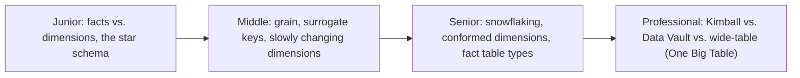
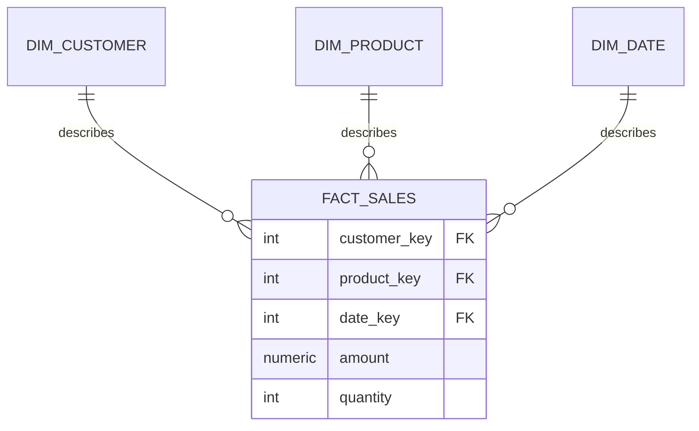

# Kimball Dimensional Modeling

> The classic warehouse modeling technique: split data into wide "fact" tables
> (measurable events) and "dimension" tables (the context around them), and
> denormalize on purpose so analysts can query without a maze of joins.

## Choose a level

| Level | Guide | You are done when |
|---|---|---|
| Junior | [Facts, dimensions, and the star schema](junior.md) | You can classify a column as a fact or a dimension attribute and draw a basic star schema. |
| Middle | [Grain, surrogate keys, and SCDs](middle.md) | You can declare a fact table's grain and implement a Slowly Changing Dimension Type 2. |
| Senior | [Snowflaking and conformed dimensions](senior.md) | You can decide when to snowflake a dimension and design a conformed dimension shared across fact tables. |
| Professional | [Kimball vs. modern alternatives](professional.md) | You can compare Kimball star schemas against Data Vault and wide denormalized tables for a real warehouse. |

## Practice rule

Before building any fact table, write one sentence: "one row in this table
represents ___." That sentence is the **grain**. If you can't write it
precisely, you will build a fact table that silently double-counts or
under-counts the moment someone joins it to a dimension at the wrong level.

## Related

- [Relational Model](../relational-model/README.md)
- [NoSQL Modeling](../nosql-modeling/README.md)
- [OLTP vs OLAP](../../operation/oltp-vs-olap/README.md)
