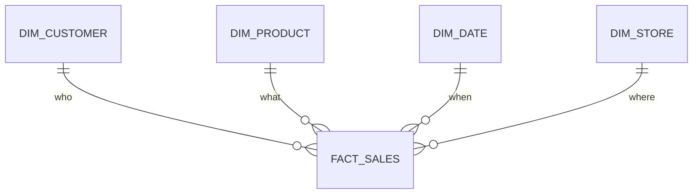

# Kimball Dimensional Modeling — Junior

<!-- level-focus -->
At junior level, focus on this question:

> What's the difference between a fact and a dimension, and why does a star
> schema make analytical queries so much simpler to write?

---

## Facts and dimensions

A **fact** is something measurable that happened: a sale, a page view, a
shipment. A **dimension** is the context that describes it: who, what, where,
when.



The **fact table** sits in the middle: a narrow set of numeric measures
(`amount`, `quantity`) plus a foreign key to each dimension. The **dimension
tables** surround it, each holding descriptive attributes (`customer.name`,
`product.category`, `date.day_of_week`). Drawn out, the FKs radiate from the
fact table like points of a star — hence **star schema**.

## Why this beats a normalized OLTP schema for analytics

Compare answering "total sales by product category, by month" in a fully
normalized OLTP schema (many small joined tables, per
[Relational Model — junior](../relational-model/junior.md)) versus a star
schema:

```sql
-- Star schema: one fact table, join straight out to two dimensions
SELECT d.month, p.category, SUM(f.amount)
FROM fact_sales f
JOIN dim_date d ON f.date_key = d.date_key
JOIN dim_product p ON f.product_key = p.product_key
GROUP BY d.month, p.category;
```

Every join is **fact → one dimension**, never dimension-to-dimension, never
more than one hop. An analyst (or a BI tool generating SQL automatically) can
navigate this without knowing the whole schema graph — which is precisely
what a deeply normalized OLTP schema does not offer.

> 🎓 **Takeaway:** a star schema is denormalization *by design*, for exactly
> one purpose — fast, simple, predictable analytical joins — accepting the
> anomaly risk because dimension tables are refreshed by a controlled pipeline,
> never hand-edited by end users (same principle as the materialized view in
> [Relational Model — senior](../relational-model/senior.md)).

## Test yourself

1. Classify each as fact or dimension: `order_amount`, `customer_name`,
   `product_category`, `quantity_shipped`, `store_region`.
2. Why does a star-schema query never need a dimension-to-dimension join?
3. `dim_product` holds `category`, which rarely changes. What would happen to
   historical `fact_sales` rows if you simply `UPDATE`d `category` in place
   when a product got reclassified? (This question is the seed of `middle.md`.)

Continue to [`middle.md`](middle.md).
