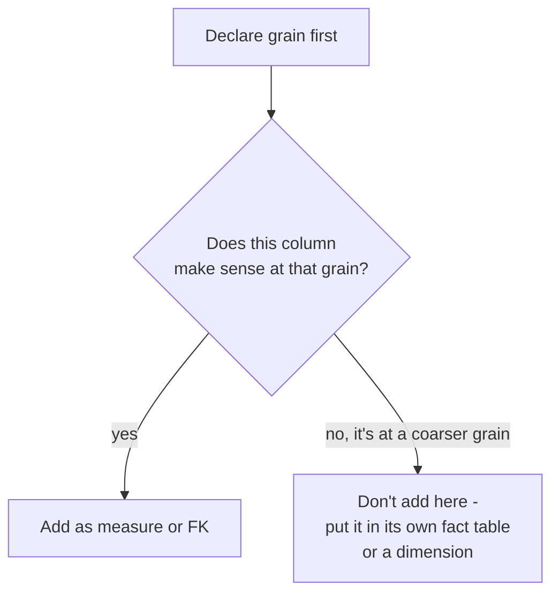

# Kimball Dimensional Modeling — Middle

<!-- level-focus -->
At middle level, focus on this question:

> How do you declare a fact table's grain, and how do you preserve history
> when a dimension attribute changes?

Prerequisite: [`junior.md`](junior.md).

---

## Grain: the single most important sentence in a fact table

The **grain** is what one row represents. Declare it explicitly before adding
a single column:

> "One row in `fact_sales` = one line item on one order."

Every measure and every dimension key must be true **at that grain**. Mixing
grains in one table — e.g. adding an "order-level shipping fee" column to a
line-item-grain fact table — causes silent double-counting the moment someone
sums that column across multiple line items of the same order.



## Surrogate keys

Dimension tables use a **surrogate key** — a meaningless, pipeline-generated
integer (`customer_key`) — instead of the source system's natural key
(`customer_id` from the OLTP database). The fact table references the
surrogate key, not the natural key.

```sql
CREATE TABLE dim_customer (
    customer_key SERIAL PRIMARY KEY,   -- surrogate, generated here
    customer_id INT,                    -- natural key, from the source system
    name TEXT,
    city TEXT,
    valid_from DATE,
    valid_to DATE,
    is_current BOOLEAN
);
```

The surrogate key is what lets a warehouse keep **multiple historical
versions** of the same natural-key entity — which is exactly the tool needed
for the "what happens when `category` changes" question from `junior.md`.

## Slowly Changing Dimensions (SCD)

| Type | Behavior | Use when |
|---|---|---|
| **Type 1** | Overwrite in place. History is lost. | The old value was simply wrong (a typo fix), or history genuinely doesn't matter. |
| **Type 2** | Insert a new row with a new surrogate key; close out the old row (`valid_to`, `is_current = false`). | You need to report historical facts using the dimension value **as it was at the time** (e.g. "sales by the product's category at time of sale"). |
| **Type 3** | Add a new column (`previous_category`) holding just the prior value. | You only need to compare "current vs. one prior value," not full history. |

**Type 2 in practice:**

```sql
-- Product moves from category 'Electronics' to 'Smart Home'
UPDATE dim_product
SET valid_to = CURRENT_DATE, is_current = false
WHERE product_id = 9 AND is_current = true;

INSERT INTO dim_product (product_id, category, valid_from, valid_to, is_current)
VALUES (9, 'Smart Home', CURRENT_DATE, NULL, true);
```

Existing `fact_sales` rows still point at the **old** surrogate key, so a
historical query still correctly reports those sales under `Electronics` —
the fact table's history is preserved exactly because it references a
surrogate key, not a mutable natural key.

## Test yourself

1. Write the grain statement for a fact table that captures daily inventory
   snapshots per warehouse per product.
2. Why would Type 1 be the wrong choice for tracking a customer's changing
   sales region, if the company reports historical revenue by region?
3. What breaks if a fact table stores the dimension's *natural* key instead of
   its surrogate key, once SCD Type 2 is introduced?

Continue to [`senior.md`](senior.md).
