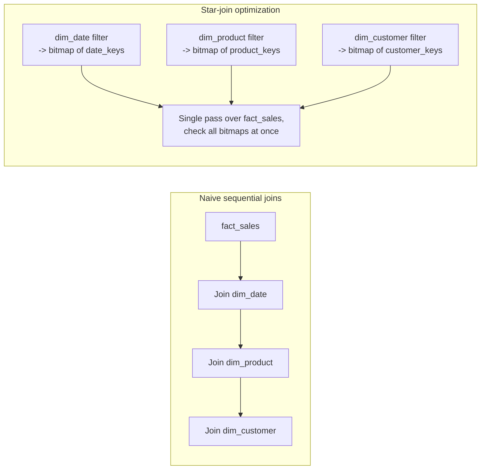

# Kimball Dimensional Modeling — Professional

<!-- level-focus -->
At professional level, focus on this question:

> What do star schemas actually do to a columnar query engine's execution
> plan under the hood, and how do modern engines change the historical
> trade-offs Kimball designed around?

Prerequisite: [`senior.md`](senior.md).

---

## The star-join optimization: why fact/dimension shape isn't just style

Columnar engines (Vertica originally, and now virtually every MPP/columnar
warehouse) implement a specific physical optimization called a **star-join**
or **star-schema join elimination**: when the planner recognizes a large
fact table joined to several small dimension tables on their surrogate keys,
it doesn't execute N sequential hash joins. Instead it evaluates each
dimension's filter predicate first, builds a compact **bitmap/bloom filter
per dimension** of qualifying surrogate keys, and applies all of them as a
single filtered scan pass over the fact table — visiting each fact row
**once**, checking membership against N small bitmaps, rather than
materializing N intermediate join results.



This is *why* the star schema's specific shape (one wide fact, several small
conformed dimensions, joins only on surrogate keys) is a genuine physical
optimization target, not an aesthetic preference — snowflaking a dimension
(senior.md) can defeat this optimization if the engine can no longer treat
the dimension chain as a single small filterable set, forcing it back onto
more expensive multi-hop joins.

## SCD Type 2 at scale: the surrogate-key join amplification problem

A Type 2 SCD means a single natural-key entity (one real customer) maps to
**N surrogate-key rows** over its history. At scale, this creates two
underappreciated costs:

- **Fact table fan-out on re-load.** If a historical fact table must be
  reprocessed (a backfill, a bug fix) and the join to `dim_customer` is done
  on a natural key with a `BETWEEN valid_from AND valid_to` temporal
  predicate instead of the surrogate key, the join becomes a non-equi join —
  most engines cannot hash-join this efficiently and fall back to nested-loop
  or merge-based temporal join strategies, which scale far worse. **Always
  resolve to the surrogate key once, upstream, before the fact load** —
  never let a temporal non-equi join happen at fact-table scale.
- **Dimension table row count growth compounds indexing/compression cost.**
  A `dim_customer` with heavy Type 2 churn (e.g. a frequently-updated
  attribute tracked with full history) can grow to 10-50x its natural
  entity count. Columnar compression (dictionary encoding, run-length
  encoding) degrades as cardinality grows relative to a column's natural
  domain — a `category` column with 20 real values compresses beautifully at
  1M rows and far worse at 50M SCD-churned rows with mostly-repeated but
  now-scattered values, because RLE depends on physical row ordering, not
  just logical cardinality.

## Modern engines are eroding some of Kimball's original trade-offs

Kimball designed the star schema in an era of row-store, disk-seek-bound
databases where join cost dominated everything. Two shifts change the
calculus a staff engineer should account for:

- **Cheap wide-table joins via vectorized execution and SIMD.** Vectorized
  query engines (DuckDB, modern Snowflake/BigQuery internals, ClickHouse)
  process batches of rows through SIMD-friendly operators, making a join
  against a moderately-sized dimension dramatically cheaper in absolute
  terms than the disk-seek-per-row cost Kimball's original recommendations
  assumed — narrowing (not eliminating) the performance gap that used to
  justify aggressive denormalization into OBTs for every hot report.
- **Metadata-driven pruning (zone maps, min/max block stats) reduces the
  penalty for "extra" dimension joins** when dimension tables are
  well-clustered, because the engine can skip whole blocks of the dimension
  without a full scan, further reducing the physical cost gap between a
  "clean" star join and a wide OBT for filtered queries.

The professional-level takeaway is *not* "OBTs are always fine now" — it's
that the engine you're actually running on has a specific set of physical
optimizations (star-join elimination, vectorization, zone maps), and your
modeling decision should be validated against `EXPLAIN`/query-profile output
on that engine, not against Kimball-era assumptions from row-store hardware.

## Production checklist (staff-level)

1. **Verify your engine actually implements star-join optimization before
   assuming the star schema's benefit is "free."** Not every engine does;
   check the query profiler for bitmap/semi-join push-down versus literal
   sequential hash joins.
2. **Never resolve SCD Type 2 temporal joins at fact-table read time at
   scale.** Resolve surrogate keys once during ETL/ELT load; the fact table
   should only ever join dimensions on an equi-join surrogate key.
3. **Monitor dimension table compression ratio over time**, not just row
   count — a degrading compression ratio on a Type-2-churned dimension is an
   early warning of a compaction/reclustering need before query performance
   visibly regresses.
4. **Profile a representative query on the actual target engine before
   ratifying a modeling decision** (star vs. snowflake vs. OBT) in a design
   review — cite the query plan, not general theory, as evidence.
5. **Treat the bus matrix (conformed dimensions) as a governance artifact
   with an owner and a change-review process**, not just a diagram — at
   scale, the cost of an un-conformed dimension is discovered by
   dashboards silently disagreeing, which is far more expensive to diagnose
   than preventing it up front.

## Cheat Sheet

```text
+------------------------------------------------------------------+
|          KIMBALL MODELING — ENGINE INTERNALS & SCALE                |
+------------------------------------------------------------------+
| Star-join optimization: engine builds per-dimension bitmaps from       |
| filters, does ONE pass over the fact table checking all bitmaps -      |
| this is WHY star shape (surrogate-key equi-joins only) is a real       |
| physical optimization target, not just style                          |
+------------------------------------------------------------------+
| SCD Type 2 at scale:                                                   |
|   NEVER resolve temporal (BETWEEN valid_from/valid_to) joins at        |
|   fact-table scale - resolve surrogate keys upstream in ETL/ELT        |
|   heavy Type 2 churn degrades columnar compression (RLE depends        |
|   on physical row order, not just logical cardinality)                 |
+------------------------------------------------------------------+
| Modern vectorized/SIMD engines + zone maps narrow (not eliminate)      |
| the historical star-vs-OBT performance gap - validate on the real      |
| engine's query profiler, don't assume Kimball-era row-store physics    |
+------------------------------------------------------------------+
```

## Test yourself

1. Explain, in terms of bitmap filters and a single fact-table pass, why
   snowflaking a dimension can defeat an engine's star-join optimization.
2. A nightly backfill job joins `fact_sales` to `dim_customer` using
   `sale_date BETWEEN valid_from AND valid_to` instead of a surrogate key.
   Why does this scale poorly, and what's the fix?
3. A heavily Type-2-churned `dim_product` table's compression ratio has
   dropped 40% over a year with no change in real product catalog size.
   What's the likely cause, and what would you check?

## Further Reading

- Michael Stonebraker et al. — "C-Store: A Column-oriented DBMS" (the
  academic origin of star-join/bitmap-filter execution strategies later
  productized in Vertica).
- Ralph Kimball & Margy Ross — *The Data Warehouse Toolkit* (original
  design rationale, useful to contrast against current engine internals).
- ClickHouse / DuckDB engineering blogs — vectorized execution and
  zone-map/min-max pruning internals.
- See also: [Query Optimization — professional](../../performance/15-query-optimization/professional.md),
  [OLTP vs OLAP — professional](../../operation/21-oltp-vs-olap/professional.md).
