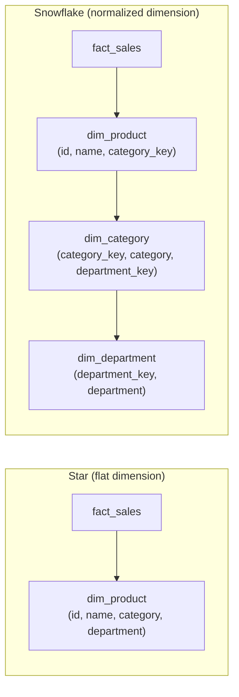
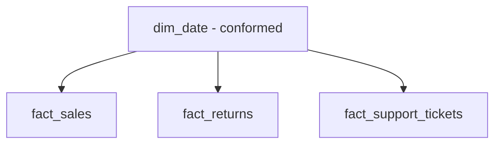

# Kimball Dimensional Modeling — Senior

<!-- level-focus -->
At senior level, focus on this question:

> When do you snowflake a dimension instead of keeping it flat, and how do
> you share dimensions safely across multiple fact tables?

Prerequisite: [`middle.md`](middle.md).

---

## Snowflaking: normalizing a dimension

A **snowflake schema** normalizes a dimension into sub-dimensions instead of
keeping it as one flat, wide table.

| | Star (flat) | Snowflake (normalized) |
|---|---|---|
| Query joins | Fewer — fact joins straight to `dim_product`. | More — fact joins `dim_product` joins `dim_category` joins `dim_department`. |
| Storage | Some duplication (`department` repeated per product). | No duplication — smaller dimension tables. |
| Update cost | Renaming a department means updating every product row that mentions it. | Renaming a department means updating one row in `dim_department`. |
| BI tool friendliness | High — most tools generate simpler SQL against a flat star. | Lower — deeper join paths are harder for self-service tools to navigate. |

**Kimball's own guidance**: snowflake only when a sub-dimension changes
independently and frequently enough that duplication becomes a real
maintenance cost, or when storage genuinely matters (rare in modern columnar
warehouses, where flat dimensions compress extremely well). Default to flat
star schemas; snowflake as a deliberate exception, not a default reflex.

## Conformed dimensions

A **conformed dimension** is one dimension table (e.g. `dim_date`,
`dim_customer`) reused across multiple fact tables (`fact_sales`,
`fact_returns`, `fact_support_tickets`), so metrics from different fact tables
can be compared and combined correctly.

Without a conformed `dim_date`, three teams might each build their own date
dimension with slightly different fiscal-year boundaries or holiday flags —
and "sales this quarter" from one fact table silently disagrees with "returns
this quarter" from another, because "quarter" means two different things. The
**Kimball bus matrix** — a grid of fact tables × conformed dimensions — is the
governance tool for tracking which dimensions are shared and enforcing that
every new fact table reuses them instead of reinventing them.

## Fact table types

| Type | Grain | Example |
|---|---|---|
| **Transaction fact** | One row per discrete event. | One row per line item sold. |
| **Periodic snapshot** | One row per entity per fixed time interval, even if nothing happened. | One row per account per day, holding its balance. |
| **Accumulating snapshot** | One row per process instance, updated in place as it moves through stages. | One row per order, with columns for `ordered_at`, `shipped_at`, `delivered_at`, updated as each milestone occurs. |

Mixing these types in one table is a common senior-level mistake — an
accumulating snapshot updated in place violates the append-mostly assumption
most warehouse engines are optimized for, and mixing it with transaction-grain
facts breaks the grain rule from `middle.md`.

## Test yourself

1. Give one concrete reason to snowflake `dim_geography` into
   `dim_city → dim_state → dim_country` in a warehouse with 500M customer rows.
2. Why does a non-conformed `dim_date` across two fact tables cause a bug that
   is hard to detect in code review but easy to detect from a dashboard?
3. Design the accumulating snapshot fact table for an order-fulfillment
   pipeline with stages: ordered, paid, shipped, delivered. What happens to a
   row if the order is later returned — does that fit the same table?

Continue to [`professional.md`](professional.md) to compare Kimball against
Data Vault and modern wide-table approaches.
