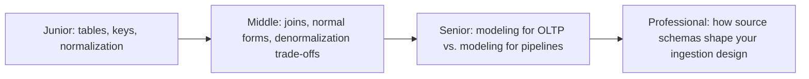
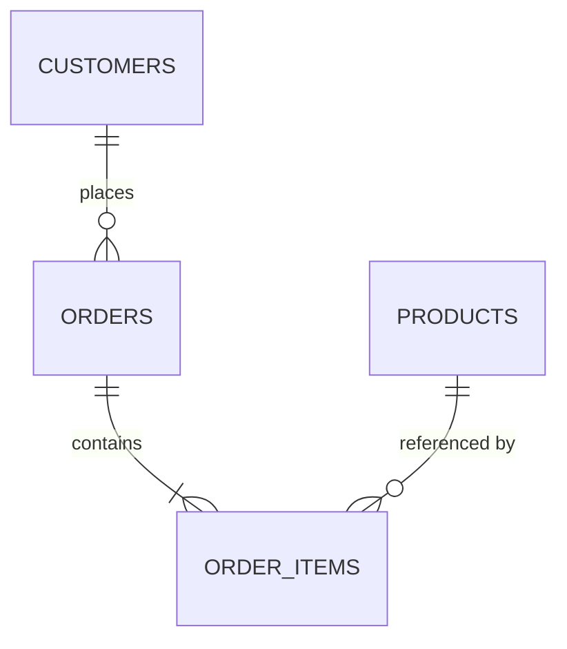

# Relational Model

> Structure data as tables of rows related by keys, and let a query engine
> figure out how to join them back together. Every OLTP source system a data
> engineer extracts from — Postgres, MySQL, SQL Server — is built on this model.

## Choose a level

| Level | Guide | You are done when |
|---|---|---|
| Junior | [Tables, keys, and why we normalize](junior.md) | You can identify a primary key, a foreign key, and explain what an update anomaly is. |
| Middle | [Joins and normal forms](middle.md) | You can normalize a flat table to 3NF and explain the join cost you just introduced. |
| Senior | [Modeling trade-offs for real workloads](senior.md) | You can decide when to denormalize and defend it against a concurrency/consistency argument. |
| Professional | [Source schemas and pipeline design](professional.md) | You can look at a production OLTP schema and predict how it will behave as a CDC/extraction source. |

## Practice rule

Take any table you've queried with more than 5 columns and ask: "if I update
one row, what other facts implicitly change with it?" If the answer is
"several unrelated things," you're looking at an unnormalized table — that's
the itch `junior.md` scratches.

## Related

- [NoSQL Modeling](../nosql-modeling/README.md)
- [Kimball Dimensional Modeling](../kimball-modeling/README.md)
- [OLTP vs OLAP](../../operation/oltp-vs-olap/README.md)
- [Isolation Levels](../../transaction/isolation-levels/README.md)
