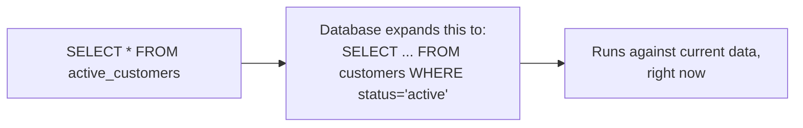

# Views — Junior

<!-- level-focus -->
At junior level, focus on this question:

> What is a view, and why does querying one always reflect the current data
> even though you "created" it once?

---

## A view is a saved query, not saved data

```sql
CREATE VIEW active_customers AS
SELECT customer_id, name, email
FROM customers
WHERE status = 'active';

-- Querying the view just runs the underlying query, every time:
SELECT * FROM active_customers WHERE email LIKE '%@gmail.com';
```



`active_customers` isn't a table with its own storage — it's a name for a
query. Every time you `SELECT` from it, the database re-runs the underlying
query against the live `customers` table. This means:

- The view is **always as fresh as the underlying table** — there's no
  "refresh" step, because nothing is stored.
- The view **costs a full query execution every time it's read** — if the
  underlying query is expensive (joins, aggregations), you pay that cost on
  every read, not once.

## Why use a view at all?

- **Simplify a repeated complex query.** Instead of every analyst writing the
  same 4-table join, they `SELECT * FROM order_summary`.
- **Restrict access.** Grant a view that only exposes certain columns/rows
  (e.g. hide `salary`) instead of granting direct table access.
- **Provide a stable interface.** If the underlying tables' schema changes,
  you can update the view's definition to keep serving the same shape to
  consumers — a form of decoupling explored further in `professional.md`.

> 🎓 **Takeaway:** a view trades "always fresh, zero storage" for "pays the
> full query cost on every read." When that cost becomes too high for how
> often the view is queried, you want a **materialized** view instead —
> `middle.md`'s subject.

## Test yourself

1. If `customers` gets a new row right now, does `active_customers` need to
   be "refreshed" to see it? Why or why not?
2. Why might granting access to a view be safer than granting access to the
   underlying table directly?
3. A view wraps a query joining 5 large tables. What happens to query latency
   if 1,000 analysts each run `SELECT * FROM that_view` simultaneously?

Continue to [`middle.md`](middle.md).
